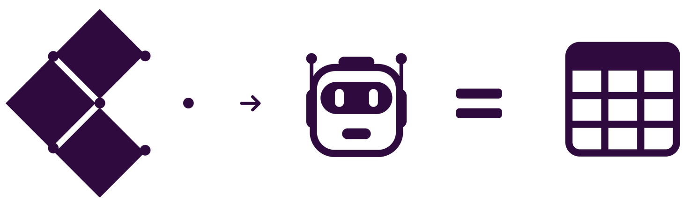

# Percolate: Build your AI directly in Multi-modal Postgres

Rather than build application-tier agentic frameworks that connect to language models, tools and databases, Percolate brings language models, tools and agents into the database.

You can now orchestrate powerful agentic systems with multi-modal RAG using any language - that includes natural language. You can easily connect any LLM APIs and integrated your language models, tools and data directly inside the database. 


```sql
select * from percolate('Create task to deploy Percolate to cloud with instructions', 
  'claude-3-5-sonnet-20241022')
```

```sql
select * from percolate('How do I use Percolate studio to interact with my instance', 
  'deepseek-chat')
```

When you interact with language models in Percolate, conversations are naturally logged in your instance for audit, analysis and optimization..

You can use tools implicitly or explicitly when you engage with Percolate.

```sql
select * from percolate_with_tools('What priority tasks did I created last week? How many did i create?', 
                                   ARRAY['query_conversations'] )
```

Try Percolate using the setup instructions below to see how it simplifies connecting AI to your data. You can run it locally, in the cloud or connect to a cloud instance. After setting up and trying a few examples, check out the Recipes in the docs to go deeper.

## Easy set up

The easiest way to get started is simply to launch the docker instance and connect to postgres using your preferred client on port 5438 using `postgres:postgres` to login

```bash
docker compose up -d
```

The docker compose expects keys to be in your environment for a seamless start for example `OPENAI_API_KEY`. The database is setup to configure some models that expect keys like this.

There is a python client and API. The API is also exposed via port 8008 on the docker instance. To install the python client locally 
```bash
pip install percolate-db
```

The Python client is optional but its useful to easily ingest data and it also provides a lightweight agentic workflow on top of Pydantic for example to stream results or to handle multi-step reasoning. See the docs to learn more about working with Percolate any Python or other languages.

### Configure

You can register you own APIs and tools and integrate LLM APIs such as those from OpenAI, Anthropic, Cerebras, Grow, DeepSeek, Google etc. All of these are registered in your Percolate instance along with your declarative agents. This section will show you the basks and you can check out the documentation links for more details

### Installing To K8s

To install Percolate on your cluster simply apply the manifest below in your cluster. See the documentation for more details. See the docs to learn more.

```yaml
#percolate-cluster.yaml
#kc apply -f percolate-cluster.yaml
apiVersion: postgresql.cnpg.io/v1
kind: Cluster
metadata:
  name: percolate
spec:
  #the operator needs to use 16 as a postgres version
  imageName: percolationlabs/postgres-base:16
  instances: 1
  storage:
    size: 10Gi
```

To use this you need the Cloud Native PG Operator on your cluster

```bash
kubectl apply --server-side -f \
  https://raw.githubusercontent.com/cloudnative-pg/cloudnative-pg/main/releases/cnpg-1.24.0.yaml

```

### Launching an instance (Coming soon)

To connect to a dedicated Percolate cloud instance, you will be able request a Percolate API KEY and use the percolate client to setup and connect to a new instance. 

## On the Roadmap

1. Query optimizers: we built Percolate to allow for multi-modal RAG queries to be intelligently optimized in the data tier. Having put the framework in place, our primary objective is to focus on the query planners
2. In the new database paradigm, it should be possible to interact with databases using natural language. We are building percolate studio for query composition and data visualization powered with AI.
3. Any issues or suggestions you add will hopefully make their way into our prioritized roadmap so feel free to suggesting anything!


## Developers

The Postgres Extension is built in C and Zig. Instructions to install locally and develop the extension are given below. 

## Connect and Learn

To learn more about Percolate, checkout the links below.

- [Docs](https://percolation-labs.gitbook.io/percolation-labs)
- [Youtube](https://www.youtube.com/@PercolationLabs)
- [Substack](https://percolationlabs.substack.com/)
- [Medium](https://medium.com/percolation-labs)
- [PercolationLabs](https://percolationlabs.ai/)
- Discord
- Bluesky
