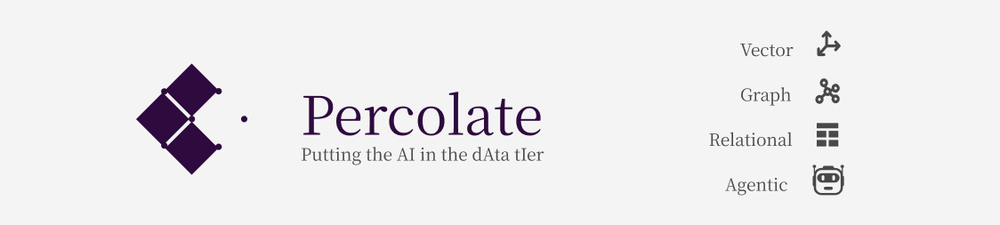

# Percolate - Build your AI directly in multi-modal Postgres
---

Keep in touch - [Substack](https://ercolationlabs.substack.com/) - [Medium](https://medium.com/percolation-labs) - [Bluesky](https://sky.app/profile/percolationlabs.bsky.social) - [Docs](https://percolation-labs.gitbook.io/percolation-labs) - [Youtube](https://www.youtube.com/@PercolationLabs) - [Percolation Labs](https://percolationlabs.ai/)

---

_Percolate_ is a relational-vector-graph/key-value database for building agentic systems. It provides a foundation for you to manage tools, models and agents in one place and build applications that scale in complexity. 

Percolate pushes agentic workflows into the data tier, leading to a simpler application tier.  

- Get set up in a few minutes by launching the Percolate instance on docker. 
- Use the cli from source to initialize data within your local instance (see notes below).
- Use Percolate with your preferred Postgres client, without any other programming language. 


```sql
-- quick ping/test
select * from percolate('What is the capital of ireland?')
--select * from percolate('What is the capital of ireland?', 'claude-3-5-sonnet-20241022')
--select * from percolate('what is percolate', 'gemini-2.0-flash')
--select * from percolate('what is percolate', 'gemini-2.0-flash-thinking-exp-01-21')
```

```sql
-- in my testing deep seek may be slow at times, especially with large content (via their api at least)
select * from percolate('how can percolate help me with creating agentic systems', 
  'deepseek-chat')
--cerebras model (lower context window but good for quick questions)
select * from percolate('briefly describe percolate', 
  'cerebras-llama3.1-8b')
--
select * from percolate('briefly describe percolate', 
  'gemini-1.5-flash')
```


When you interact with language models in Percolate, conversations are logged in your instance for audit, analysis and optimization.
We create new `Session` records with user questions and track each `AIResponse`, which may include tool calls and evaluations. One of the ways Percolate is useful is for _resuming_ and replaying sessions or getting a better understanding of the payloads that are sent to LLM Apis.

**Outside the database, use your preferred language**

Percolate focuses on building agents from the data tier. But you can use Python too. To create a Python agent (and also register it in the database) follow the example below.
Below you will see an example of adding an agent that uses the `get_pet_findByStatus` function - (we show how to register functions and apis below) -

```python
import percolate as p8
from pydantic import BaseModel,Field
import typing
from percolate.models import DefaultEmbeddingField

class MyFirstAgent(BaseModel):
    """You are an agent that provides the information you are asked and a second random fact"""
    #because it has no config it will save to the public database schema
    
    name: str = Field(description="Task name")
    #the default embedding field is just settings json_schema_extra.embedding_provider, so you can do that yourself
    description:str = DefaultEmbeddingField(description="Task description")
    
    @classmethod
    def get_model_functions(cls):
        """i return a list of functions by key stored in the database"""
        return {
            'get_pet_findByStatus': "a function i use to look up pets based on their status"
        }
#register creates tables to save data of this type and search for agents
#you do not not need to register the agent to use the Python examples.
p8.repository(MyFirstAgent).register()
```

## Easy set up

The easiest way to get started is simply to launch the docker instance and connect to postgres using your preferred client on port 5438 using `postgres:postgres` to login

```bash
docker compose up -d
```

---

You can run the client directly from the python project directory `clients/python/percolate`
- _You can use the poetry project _

Use the cli to apply data to your test database. 
- _This assumes you have launched the docker instance or you have connected to another instance of Percolate._

The command below will apply settings from a default 'project' under `/studio/projects/default`. 
- _Projects in percolate manage configurations of data such as models, agents and apis. You can also version control your projects and re-apply them later._ 

```bash
cd clients/python/percolate
#the default project syncs env, indexes docs in codebase and adds the test api(s) as illustrated in the next step
poetry install #the first time for deps
poetry run p8 init #this will run the init script
```

Use the cli to add apis at any time - supply an optional bearer `token`

```bash
python percolate/cli.py add api https://petstore.swagger.io/v2/swagger.json --verbs get
#of if using percolate-db installation,
#p8 add api https://petstore.swagger.io/v2/swagger.json --verbs get
```

API functions can be attached by name to entities (as shown in the example above) or searched once registered as below. This can be used by planning agents to find nd activate functions during reasoning chains.

```sql
select * from p8.query_entity('I am looking for a function to get pets that have a sold status', 'p8.Function')
```

Because the function can be evaluated from the database, you can run an entire tool calling pipeline from the database.

- in practice we do not do this synchronously and this is just used to illustrate. If the models are not overloaded this can take about 5 seconds but if models are overloaded it could take up to 25 seconds

```sql
--this runs multiple turns to find a function, activate it, call the API that was registered above and then interpret the results
-- we use the run function which has an iteration limit that defaults to 3 turns
select * from run('please activate function get_pet_findByStatus and find two pets that are sold')
```

Back in Python, ask questions of your agent using whatever model(s) you have API keys for - gpt-4o is the default model -

```python
p8.Agent(MyFirstAgent).run("List some pets that are sold") #this is using the api we registered above
#p8.Agent(MyFirstAgent).run("List some pets that are sold", 'deepseek-chat')
#p8.Agent(MyFirstAgent).run("List some pets that are sold", 'claude-3-5-sonnet-20241022')
#p8.Agent(MyFirstAgent).run("List some pets that are sold", 'gemini-1.5-flash')
```

Or talk to your agent via the database -

```sql
select * from percolate_with_agent('List some pets that are sold', 'MyAgent')
```
---

When getting started you may find other cli utils useful too: 

```bash
cd clients/python/percolate
#index the codebase (uses your open ai key for embeddings - in future we may pull this index down from somewhere)
python percolate/cli.py index
#now we can ask questions about what is in readmes, python or sql files in the repo
python percolate/cli.py ask 'are there SQL functions in Percolate for interacting with models like Claude?'
#and yaml...
python percolate/cli.py ask 'how do i connect to Percolate using docker compose'
# python percolate/cli.py ask 'what is our entire process of adding embeddings and flushing those embeddings to make sure entities are indexed fully'
# python percolate/cli.py ask 'how is minio used in percolate'
```

### Installing To K8s

To install Percolate to your K8s cluster apply the manifest below to your cluster. See the documentation for more details.

```yaml
#percolate-cluster.yaml
#kc apply -f percolate-cluster.yaml
apiVersion: postgresql.cnpg.io/v1
kind: Cluster
metadata:
  name: percolate
spec:
  #the operator needs to use 16 as a postgres version
  imageName: percolationlabs/postgres-base:16
  instances: 1
  storage:
    size: 10Gi
```

To use this you need the [Cloud Native PG Operator](https://cloudnative-pg.io/) on your cluster

```bash
kubectl apply --server-side -f \
  https://raw.githubusercontent.com/cloudnative-pg/cloudnative-pg/main/releases/cnpg-1.24.0.yaml

```

### Launching an instance (Coming soon)

To connect to a dedicated Percolate cloud instance, you will be able request a Percolate API KEY and use the percolate client to setup and connect to a new instance. 

## On the Roadmap

The main reason we created Percolate is to work on a new type of query plan that involves both agents and data. We wanted to push Agentic AI down into the data tier because we think it is natural to do so. Importantly data are multi-modal and rather than using multiple stores for key-value, relational, graph and vector, we want this all in the same place, first for convenience and then for optimization. Building this optimizer is of course non trivial. 

We have some things to work out regarding database background workers to achieve a great user experience for agentic workflows that use the database during multi-hop reasoning. 

Another exciting avenue is an SQL coding environment that uses AI and the data and schema stored in Percolate. 
In the new database paradigm, it should be possible to interact with databases using natural language. We are building _Percolate Studio_ for query composition and data visualization powered with AI.

Any issues or suggestions you add will hopefully make their way into our prioritized roadmap so feel free to suggest anything related to putting AI in the dAta tIer.


## Developers

### Percolate API
(WIP)
We can map dev api to the same target as what the docker compose uses to test new endpoints. There are many ways to do this but its easiest to replace the service at the target.
Stop the docker service and launch the local development instance of the API.
```bash
#ollama is included by default and it takes a moment to fetch the first time but you can comment out this service if you like
docker compose stop percolate-api
uvicorn percolate.api.main:app --port 5008 --reload 
```

Now we are running the dev server on the same location that the database etc expects e.g. if you look in the p8.ApiProxy in percolate you will see we have percolate at `percolate-api:5008`.
You must therefore add percolate-api mapped to localhost in your hosts files!

### Docker

Building the api locally

```bash
docker buildx build --platform linux/amd64,linux/arm64 -t percolationlabs/percolate-api:latest --push .
#pull latest if needed for platform
docker pull percolationlabs/percolate-api:latest
#update docker compose service if needed 
docker compose up -d --no-deps --build percolate-api
```

You may in some cases want to update your /etc/hosts to resolve the server address so that your python client matches what is running in the docker for api uris.

```bash
127.0.0.1 percolate-api
```

## Connect and Learn

To learn more about or stay up to date on Percolate, check out the links below. Subscribe to the channels below and we look forward to hearing from you. 

**❤️  Please star this repo if you find it interesting ❤️**

---

- [Docs](https://percolation-labs.gitbook.io/percolation-labs)
- [Medium](https://medium.com/percolation-labs)
- [Substack](https://percolationlabs.substack.com/)
- [Youtube](https://www.youtube.com/@PercolationLabs)
- [Bluesky](https://bsky.app/profile/percolationlabs.bsky.social)
- [Percolation Labs](https://percolationlabs.ai/)
