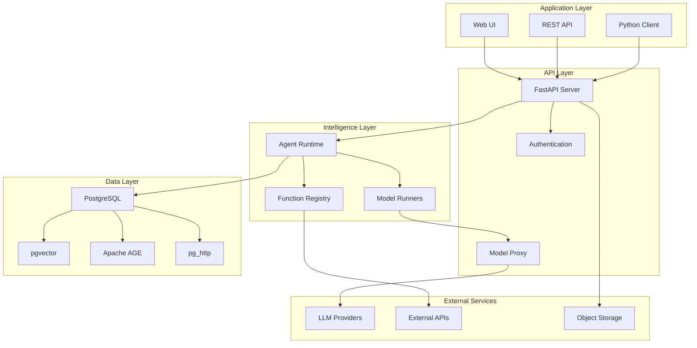
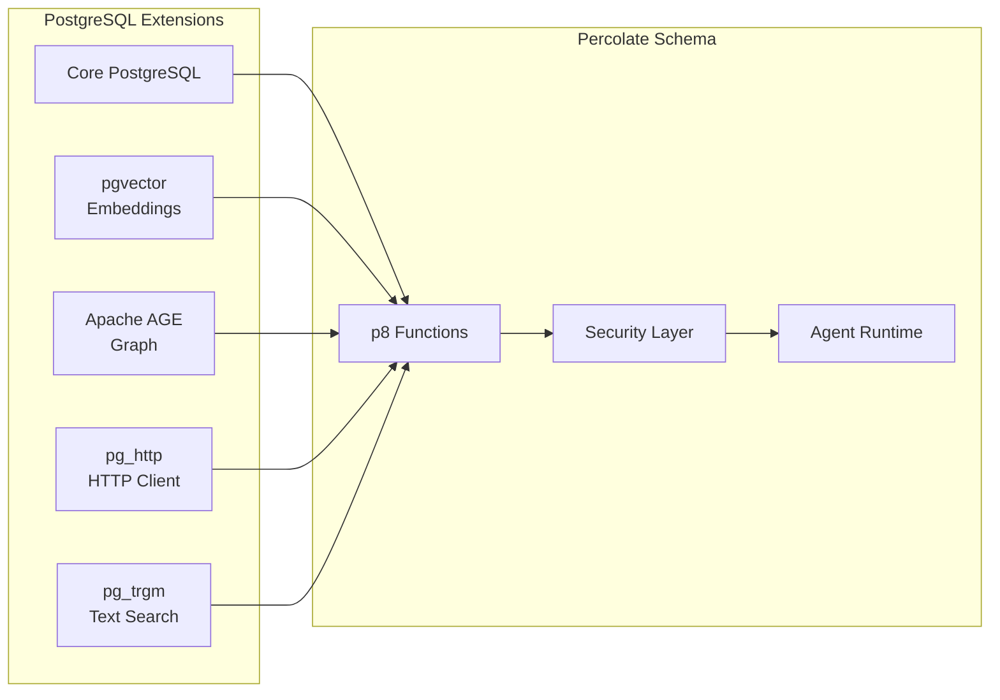
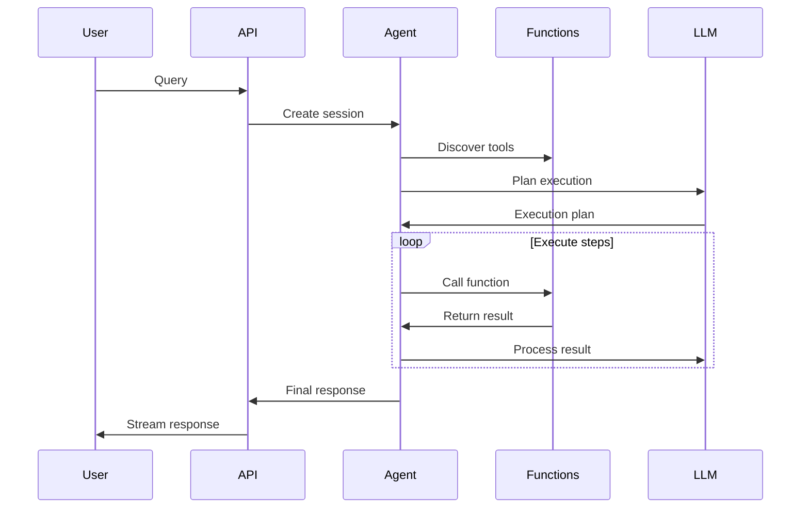
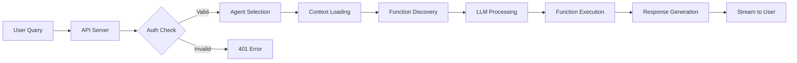
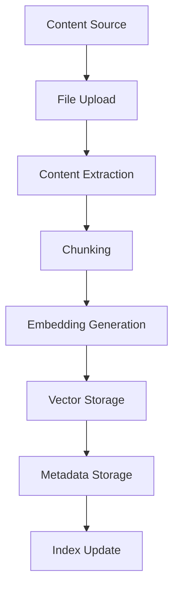
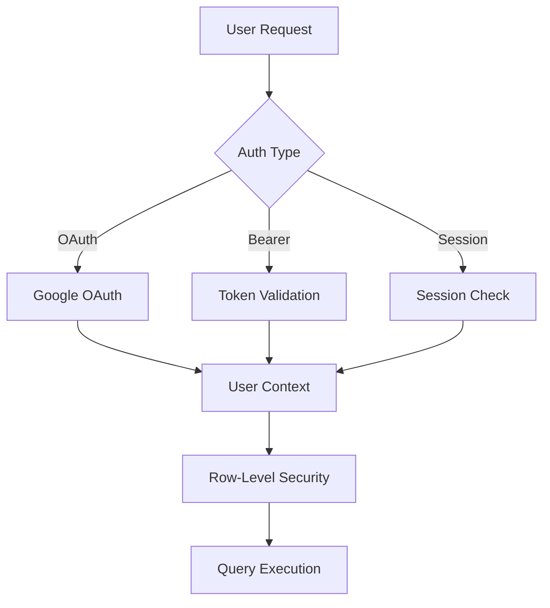
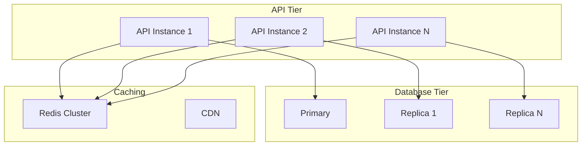

# Percolate Architecture Guide

## Table of Contents
1. [Overview](#overview)
2. [Core Design Philosophy](#core-design-philosophy)
3. [System Architecture](#system-architecture)
4. [Component Architecture](#component-architecture)
5. [Data Flow](#data-flow)
6. [Security Architecture](#security-architecture)
7. [Scalability & Performance](#scalability--performance)

## Overview

Percolate is an approach to building AI-powered applications that pushes intelligence into the database tier. By combining relational, vector, graph, and key-value capabilities in a single PostgreSQL-based system, Percolate enables developers to build sophisticated agentic systems with minimal application code.



## Core Design Philosophy

### 1. **Intelligence in the Database**
Traditional AI applications separate data storage from intelligence, leading to complex architectures. Percolate embeds AI capabilities directly in PostgreSQL.

### 2. **Multi-Modal Data Platform**
Percolate treats all data types as first-class citizens:
- **Relational**: Traditional structured data
- **Vector**: Embeddings for semantic search
- **Graph**: Relationships and networks
- **Key-Value**: Flexible document storage

### 3. **Declarative Agent Development**
Agents are defined as Pydantic models with:
- Automatic function discovery
- Built-in semantic search
- Type-safe interfaces
- Self-documenting capabilities

## System Architecture

### Core Components



## Component Architecture

### 1. **Database Layer**

The database layer is built on PostgreSQL 16+ with critical extensions:

```sql
-- Core extensions
CREATE EXTENSION IF NOT EXISTS vector;
CREATE EXTENSION IF NOT EXISTS age;
CREATE EXTENSION IF NOT EXISTS http;
CREATE EXTENSION IF NOT EXISTS pg_trgm;

-- Percolate schema
CREATE SCHEMA IF NOT EXISTS p8;
```

Key database components:
- **p8 schema**: Contains all Percolate functions and tables
- **Row-level security**: Automatic user context propagation
- **Audit logging**: Complete conversation history
- **Vector indexes**: High-performance semantic search

### 2. **API Layer**

FastAPI-based REST API with:
- **OpenAPI compliance**: Full API documentation
- **Authentication**: OAuth2, bearer tokens, sessions
- **Streaming**: Server-sent events for real-time responses
- **Multi-dialect**: Support for OpenAI, Anthropic, Google formats

### 3. **Agent Runtime**

The agent runtime orchestrates:
- **Function discovery**: Semantic search over available functions
- **Planning**: Multi-step reasoning chains
- **Execution**: Tool invocation and result processing
- **Context management**: User-specific data access



## Data Flow

### 1. **Query Processing**



### 2. **Content Indexing**



## Security Architecture

### 1. **Authentication & Authorization**



### 2. **Data Isolation**

- **User context**: Automatically propagated through all queries
- **Row-level security**: PostgreSQL RLS policies
- **Function access**: Per-user function permissions
- **Audit trail**: Complete activity logging

## Scalability & Performance

### 1. **Horizontal Scaling**



### 2. **Performance Optimizations**

- **Vector indexes**: HNSW for fast similarity search
- **Connection pooling**: pgBouncer for efficient connections
- **Query optimization**: Prepared statements and caching
- **Streaming responses**: Reduced memory footprint

### 3. **Resource Management**

```yaml
# Kubernetes resource limits
resources:
  api:
    requests:
      memory: "512Mi"
      cpu: "500m"
    limits:
      memory: "2Gi"
      cpu: "2000m"
  
  postgres:
    requests:
      memory: "4Gi"
      cpu: "2000m"
    limits:
      memory: "16Gi"
      cpu: "8000m"
```

## Best Practices

### 1. **Development**
- Use declarative agent definitions
- Leverage built-in function discovery
- Implement proper error handling
- Follow type safety guidelines

### 2. **Deployment**
- Use connection pooling
- Configure appropriate resource limits
- Enable monitoring and logging
- Implement backup strategies

### 3. **Security**
- Always use authentication
- Implement least-privilege access
- Regular security audits
- Encrypt sensitive data

## Conclusion

Percolate's architecture represents a paradigm shift in building AI applications. By moving intelligence into the database tier and providing a unified multi-modal data platform, it enables developers to build sophisticated agentic systems with unprecedented simplicity and performance.