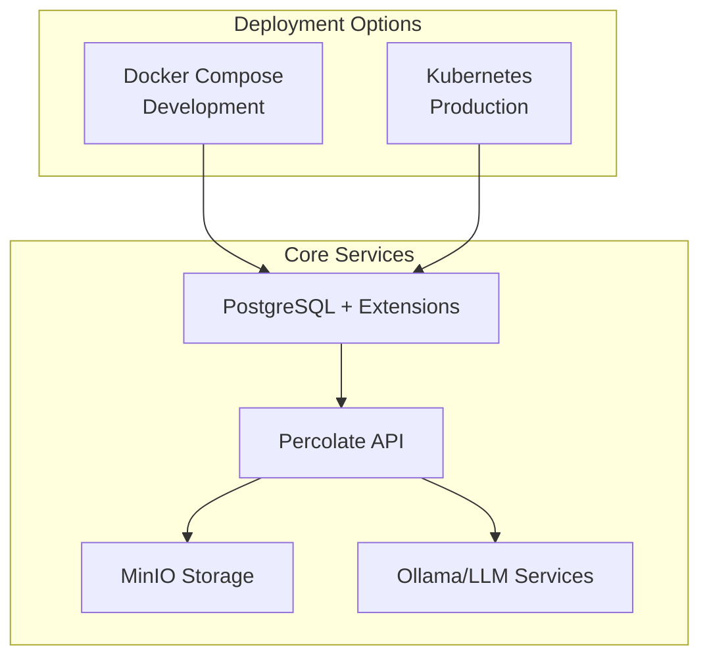

# Deployment Guide

## Table of Contents
1. [Overview](#overview)
2. [Prerequisites](#prerequisites)
3. [Docker Deployment](#docker-deployment)
4. [Kubernetes Deployment](#kubernetes-deployment)
5. [Production Configuration](#production-configuration)
6. [Backup & Recovery](#backup--recovery)
7. [Security Hardening](#security-hardening)
8. [Troubleshooting](#troubleshooting)

## Overview

Percolate can be deployed using Docker for development and small-scale deployments, or Kubernetes for production-grade installations. This guide covers both approaches with best practices for each.



## Prerequisites

### System Requirements

**Minimum Requirements:**
- CPU: 4 cores
- RAM: 8GB
- Storage: 100GB SSD
- OS: Linux (Ubuntu 20.04+, RHEL 8+) or macOS

**Recommended for Production:**
- CPU: 16+ cores
- RAM: 32GB+
- Storage: 500GB+ NVMe SSD
- Network: 1Gbps+

### Software Requirements

```bash
# Docker deployment
docker --version  # 20.10+
docker-compose --version  # 2.0+

# Kubernetes deployment
kubectl version  # 1.24+

# Optional tools
psql --version  # PostgreSQL client
```

## Docker Deployment

### 1. Quick Start

```bash
# Clone repository
git clone https://github.com/percolate-ai/percolate
cd percolate

# Start services
docker-compose up -d

# Check logs
docker logs percolate-api
```

### 2. Docker Compose Configuration

The default `docker-compose.yaml` includes:

```yaml
services:
  # Ollama for local LLM support
  ollama:
    image: ollama/ollama
    container_name: ollama-service
    ports:
      - "11434:11434"
    volumes:
      - ollama_data:/root/.ollama

  # MinIO for S3-compatible storage
  minio:
    image: quay.io/minio/minio
    container_name: minio
    ports:
      - "9000:9000"
      - "9090:9090"  # MinIO Console
    environment:
      MINIO_ROOT_USER: percolate
      MINIO_ROOT_PASSWORD: percolate

  # Percolate API
  percolate-api:
    image: percolationlabs/percolate-api
    container_name: percolate-api
    ports:
      - "5008:5008"
    environment:
      OPENAI_API_KEY: ${OPENAI_API_KEY}
      P8_PG_HOST: percolate
      P8_PG_PORT: 5432

  # PostgreSQL with extensions
  postgres:
    image: percolationlabs/postgres-base:16
    container_name: percolate
    platform: linux/amd64
    environment:
      POSTGRES_USER: postgres
      POSTGRES_PASSWORD: postgres
      POSTGRES_DB: app
    ports:
      - "5438:5432"
    volumes:
      - percolate_data:/var/lib/postgresql/percolate
      - ./extension/sql:/docker-entrypoint-initdb.d
```

### 3. Environment Configuration

Create a `.env` file:

```bash
# API Keys
OPENAI_API_KEY=your-key-here
ANTHROPIC_API_KEY=your-key-here

# Database
P8_PG_HOST=localhost
P8_PG_PORT=5438
P8_PG_DB=app
P8_PG_USER=postgres
P8_PG_PASSWORD=postgres

# MinIO
MINIO_ROOT_USER=percolate
MINIO_ROOT_PASSWORD=percolate
S3_ENDPOINT=http://localhost:9000
```

### 4. Post-Deployment Setup

```bash
# Pull embedding models for Ollama
docker compose exec ollama ollama pull bge-m3

# Access MinIO console
# http://localhost:9090
# Username: percolate
# Password: percolate

# Access the API
curl http://localhost:5008/healthcheck
```

## Kubernetes Deployment

### 1. Namespace Setup

```bash
# Create namespace
kubectl create namespace p8

# Set as default
kubectl config set-context --current --namespace=p8
```

### 2. Cloud Native PostgreSQL

```yaml
# postgres-cluster.yaml
apiVersion: postgresql.cnpg.io/v1
kind: Cluster
metadata:
  name: percolate-db
  namespace: p8
spec:
  instances: 3
  primaryUpdateStrategy: unsupervised
  
  postgresql:
    parameters:
      max_connections: "200"
      shared_buffers: "256MB"
      effective_cache_size: "1GB"
      session_preload_libraries: "age"
  
  bootstrap:
    initdb:
      database: app
      owner: percolate
      secret:
        name: percolate-db-secret
```

### 3. API Deployment

```yaml
# percolate-api.yaml
apiVersion: apps/v1
kind: Deployment
metadata:
  name: percolate-api
  namespace: p8
spec:
  replicas: 3
  selector:
    matchLabels:
      app: percolate-api
  template:
    metadata:
      labels:
        app: percolate-api
    spec:
      containers:
      - name: api
        image: percolationlabs/percolate-api:latest
        ports:
        - containerPort: 5008
        env:
        - name: P8_PG_HOST
          value: percolate-db-rw
        - name: P8_PG_PORT
          value: "5432"
        resources:
          requests:
            memory: "256Mi"
            cpu: "250m"
          limits:
            memory: "512Mi"
            cpu: "500m"
```

### 4. Service Configuration

```yaml
# percolate-service.yaml
apiVersion: v1
kind: Service
metadata:
  name: percolate-api
  namespace: p8
spec:
  selector:
    app: percolate-api
  ports:
  - port: 80
    targetPort: 5008
  type: LoadBalancer
```

### 5. Apply Configurations

```bash
# Apply all configurations
kubectl apply -f postgres-cluster.yaml
kubectl apply -f percolate-api.yaml
kubectl apply -f percolate-service.yaml

# Wait for pods to be ready
kubectl wait --for=condition=ready pod -l app=percolate-api --timeout=300s
```

## Production Configuration

### PostgreSQL Optimization

```sql
-- Key PostgreSQL settings for production
ALTER SYSTEM SET max_connections = 200;
ALTER SYSTEM SET shared_buffers = '4GB';
ALTER SYSTEM SET effective_cache_size = '12GB';
ALTER SYSTEM SET maintenance_work_mem = '1GB';
ALTER SYSTEM SET checkpoint_completion_target = 0.9;
ALTER SYSTEM SET wal_buffers = '16MB';
ALTER SYSTEM SET default_statistics_target = 100;
ALTER SYSTEM SET random_page_cost = 1.1;
ALTER SYSTEM SET effective_io_concurrency = 200;
ALTER SYSTEM SET work_mem = '16MB';

-- Reload configuration
SELECT pg_reload_conf();
```

### API Configuration

Environment variables for production:

```bash
# Performance
WORKERS=4
WORKER_CONNECTIONS=1000
WORKER_TIMEOUT=120

# Security
SECRET_KEY=your-secure-secret-key
ALLOWED_HOSTS=api.percolate.ai
CORS_ORIGINS=https://app.percolate.ai

# Database Pool
DB_POOL_SIZE=20
DB_MAX_OVERFLOW=40
DB_POOL_TIMEOUT=30

# Logging
LOG_LEVEL=INFO
LOG_FORMAT=json
```

## Backup & Recovery

### PostgreSQL Backup

```bash
# Create backup
kubectl exec -n p8 percolate-db-1 -- pg_dump -U postgres app > backup-$(date +%Y%m%d).sql

# Restore backup
kubectl exec -n p8 -i percolate-db-1 -- psql -U postgres app < backup-20240101.sql
```

### MinIO Backup

```bash
# Sync MinIO data
mc mirror --overwrite minio/percolate s3/backup-bucket/percolate/
```

## Security Hardening

### 1. Network Policies

```yaml
apiVersion: networking.k8s.io/v1
kind: NetworkPolicy
metadata:
  name: percolate-api-netpol
spec:
  podSelector:
    matchLabels:
      app: percolate-api
  policyTypes:
  - Ingress
  - Egress
  ingress:
  - from:
    - podSelector:
        matchLabels:
          app: nginx-ingress
    ports:
    - protocol: TCP
      port: 5008
```

### 2. TLS Configuration

```yaml
# ingress-tls.yaml
apiVersion: networking.k8s.io/v1
kind: Ingress
metadata:
  name: percolate-api
  annotations:
    cert-manager.io/cluster-issuer: letsencrypt-prod
spec:
  tls:
  - hosts:
    - api.percolate.ai
    secretName: percolate-api-tls
  rules:
  - host: api.percolate.ai
    http:
      paths:
      - path: /
        pathType: Prefix
        backend:
          service:
            name: percolate-api
            port:
              number: 80
```

## Troubleshooting

### Common Issues

1. **Database Connection Failed**
```bash
# Check PostgreSQL status
kubectl get pods -l cnpg.io/cluster=percolate-db
kubectl logs percolate-db-1

# Test connection
kubectl exec -it percolate-api-xxx -- psql -h percolate-db-rw -U postgres -d app
```

2. **API Not Starting**
```bash
# Check logs
kubectl logs -f deployment/percolate-api

# Check environment
kubectl exec -it deployment/percolate-api -- env | grep P8_
```

3. **MinIO Issues**
```bash
# Check MinIO status
docker logs minio

# Reset MinIO data (development only)
docker-compose down -v
docker-compose up -d
```

### Health Checks

```bash
# API health
curl http://localhost:5008/healthcheck

# Database health
docker exec percolate psql -U postgres -c "SELECT 1"

# MinIO health
curl http://localhost:9000/minio/health/live
```

### Performance Monitoring

```bash
# Database performance
SELECT 
    query,
    calls,
    total_exec_time,
    mean_exec_time,
    stddev_exec_time,
    rows
FROM pg_stat_statements
ORDER BY total_exec_time DESC
LIMIT 10;

# API metrics
curl http://localhost:5008/metrics
```