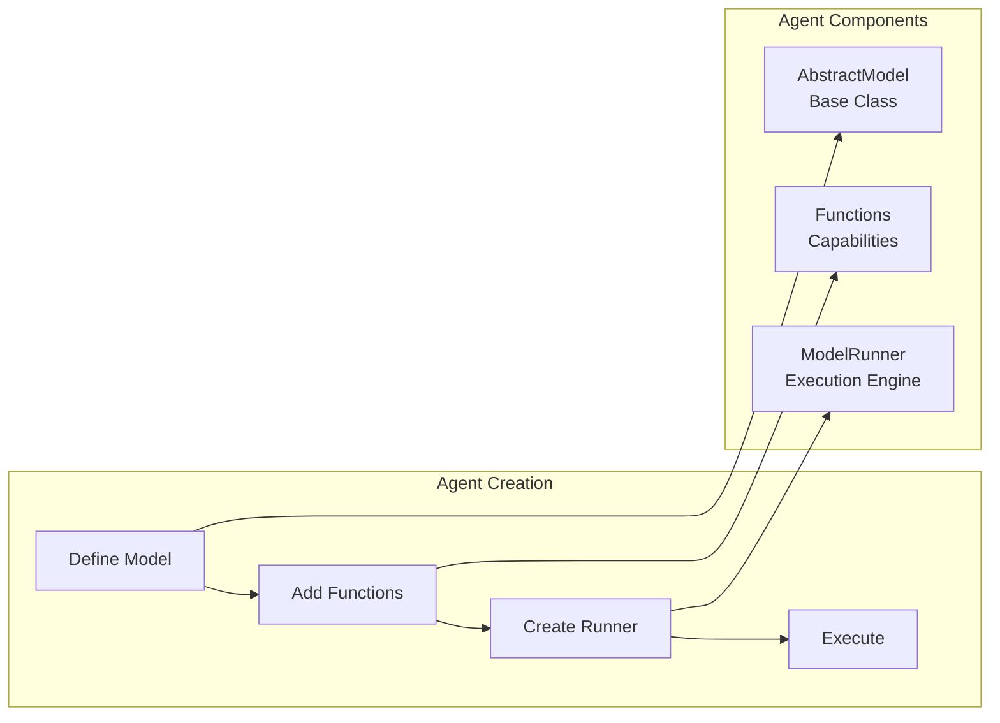

# Building Agents from Scratch

## Table of Contents
1. [Introduction](#introduction)
2. [Agent Fundamentals](#agent-fundamentals)
3. [Your First Agent](#your-first-agent)
4. [Function Integration](#function-integration)
5. [Agent Storage & Loading](#agent-storage--loading)
6. [Advanced Patterns](#advanced-patterns)
7. [Production Best Practices](#production-best-practices)
8. [Real-World Examples](#real-world-examples)

## Introduction

Agents in Percolate are AI systems built on Pydantic models that can perceive their environment, make decisions, and take actions through functions. This guide covers building agents from scratch using the actual Percolate API.



## Agent Fundamentals

### Core Concepts

**1. Agent Definition**
Agents inherit from `AbstractModel` and define their behavior through:
- System prompt (docstring)
- Functions (class methods)
- Configuration (fields)

**2. Agent Execution**
The `p8.Agent()` function creates a `ModelRunner` that:
- Loads the agent model
- Discovers available functions
- Handles LLM interaction
- Manages user context and security

**3. Function Discovery**
Functions are discovered automatically from class methods decorated with `@classmethod`.

## Your First Agent

### Step 1: Define the Agent Model

```python
import percolate as p8
from percolate.models import AbstractModel
from typing import List

class WeatherAgent(AbstractModel):
    """I provide weather information for any location. 
    I can get current conditions, forecasts, and weather alerts."""
    
    # Optional configuration fields
    default_units: str = "celsius"
    
    @classmethod
    def get_weather(cls, location: str, units: str = "celsius"):
        """Get current weather for a location
        
        Args:
            location: City name or coordinates
            units: Temperature units (celsius/fahrenheit)
        """
        # Implementation would call a weather API
        return {
            "location": location,
            "temperature": 22,
            "condition": "Sunny",
            "units": units
        }
    
    @classmethod
    def get_forecast(cls, location: str, days: int = 5):
        """Get weather forecast
        
        Args:
            location: City name or coordinates  
            days: Number of days to forecast (1-7)
        """
        # Implementation would get forecast data
        return {
            "location": location,
            "forecast": [
                {"day": "Today", "high": 25, "low": 18},
                {"day": "Tomorrow", "high": 23, "low": 16}
            ]
        }
```

### Step 2: Create and Use the Agent

```python
# Create the agent runner
agent = p8.Agent(WeatherAgent)

# Use the agent
response = agent.run("What's the weather like in London?")
print(response)

# Stream responses
for chunk in agent.stream("Give me a 5-day forecast for Tokyo"):
    print(chunk, end="")
```

## Function Integration

### Function Patterns

**1. Simple Functions**
```python
class DataAgent(AbstractModel):
    """I help with data analysis and retrieval."""
    
    @classmethod
    def search_data(cls, query: str, limit: int = 10):
        """Search for data matching the query"""
        # Use repository pattern
        from percolate.models import Resources
        repo = p8.repository(Resources)
        return repo.select(content__ilike=f"%{query}%")[:limit]
```

**2. Database Integration**
```python
class CustomerAgent(AbstractModel):
    """I manage customer information and interactions."""
    
    @classmethod  
    def find_customer(cls, email: str):
        """Find customer by email address"""
        from percolate.models import User
        repo = p8.repository(User)
        results = repo.select(email=email)
        return results[0] if results else None
    
    @classmethod
    def update_customer(cls, customer_id: str, **updates):
        """Update customer information"""
        from percolate.models import User
        repo = p8.repository(User)
        repo.update_records([{"id": customer_id, **updates}])
        return f"Updated customer {customer_id}"
```

**3. External API Integration**
```python
class WebAgent(AbstractModel):
    """I can search the web and fetch information from URLs."""
    
    @classmethod
    def web_search(cls, query: str, max_results: int = 10):
        """Search the web for information"""
        import httpx
        
        # Use Percolate's web search integration
        response = httpx.post("http://localhost:5008/x/web/search", json={
            "query": query,
            "max_results": max_results
        })
        return response.json()
    
    @classmethod
    def fetch_webpage(cls, url: str, to_markdown: bool = True):
        """Fetch and optionally convert webpage to markdown"""
        import httpx
        
        response = httpx.post("http://localhost:5008/x/web/fetch", json={
            "url": url,
            "to_markdown": to_markdown
        })
        return response.json()
```

## Agent Storage & Loading

### Saving Agents to Database

```python
# Save agent definition to database for reuse
from percolate.models.p8.types import Agent

agent_metadata = Agent(
    name="weather_agent",
    description="Weather information provider",
    spec={
        "model_name": "WeatherAgent",
        "namespace": "weather",
        "functions": ["get_weather", "get_forecast"]
    },
    metadata={
        "version": "1.0",
        "author": "Your Name"
    }
)

# Save to database
repo = p8.repository(Agent)
repo.update_records([agent_metadata])
```

### Loading Agents

```python
# Load agent from database
agent_model = Agent.load("weather_agent")

# Create runner
agent = p8.Agent(agent_model)

# Use the loaded agent
response = agent.run("What's the weather forecast?")
```

## Advanced Patterns

### Multi-Step Agents

```python
class ResearchAgent(AbstractModel):
    """I conduct thorough research on topics by combining multiple sources."""
    
    @classmethod
    def research_topic(cls, topic: str, depth: str = "comprehensive"):
        """Research a topic using multiple approaches"""
        # This agent can call multiple functions in sequence
        web_results = cls.web_search(topic)
        internal_results = cls.search_internal_data(topic)
        
        return {
            "topic": topic,
            "web_findings": web_results,
            "internal_findings": internal_results,
            "summary": f"Research completed on {topic}"
        }
    
    @classmethod
    def web_search(cls, query: str):
        """Search web for information"""
        # Implementation
        pass
    
    @classmethod  
    def search_internal_data(cls, query: str):
        """Search internal knowledge base"""
        from percolate.models import Resources
        repo = p8.repository(Resources)
        return repo.search(query)
```

### Agents with User Context

```python
class PersonalAssistant(AbstractModel):
    """I'm your personal assistant with access to your data and preferences."""
    
    @classmethod
    def get_my_tasks(cls, user_id: str):
        """Get tasks for the current user"""
        # User context is automatically handled by the repository
        from percolate.models import Task
        repo = p8.repository(Task)  # Respects user's row-level security
        return repo.select(status="pending")
    
    @classmethod
    def schedule_meeting(cls, title: str, attendees: List[str], time: str):
        """Schedule a meeting"""
        # Implementation would integrate with calendar
        return f"Scheduled '{title}' with {', '.join(attendees)} at {time}"

# Use with user context
agent = p8.Agent(
    PersonalAssistant,
    user_id="123e4567-e89b-12d3-a456-426614174000",
    user_groups=["employees"],
    role_level=10
)
```

### Streaming Agents

```python
class WritingAgent(AbstractModel):
    """I help with writing tasks, providing real-time feedback."""
    
    @classmethod
    def write_article(cls, topic: str, style: str = "professional"):
        """Write an article on the given topic"""
        # This would be called by the LLM during streaming
        return f"Starting article on {topic} in {style} style..."

# Use with streaming
agent = p8.Agent(WritingAgent)

# Stream the response
for chunk in agent.stream("Write an article about AI agents"):
    print(chunk, end="", flush=True)
```

## Production Best Practices

### 1. Error Handling

```python
class RobustAgent(AbstractModel):
    """Production-ready agent with proper error handling."""
    
    @classmethod
    def safe_operation(cls, data: str):
        """Perform operation with error handling"""
        try:
            # Validate input
            if not data or len(data.strip()) == 0:
                return {"error": "Input data is required"}
            
            # Perform operation
            result = cls._process_data(data)
            return {"success": True, "result": result}
            
        except Exception as e:
            return {"error": f"Operation failed: {str(e)}"}
    
    @classmethod
    def _process_data(cls, data: str):
        """Internal processing method"""
        # Implementation
        return f"Processed: {data}"
```

### 2. Input Validation

```python
from pydantic import validator

class ValidatedAgent(AbstractModel):
    """Agent with input validation."""
    
    @classmethod
    def create_user(cls, email: str, name: str, age: int):
        """Create a new user with validation"""
        # Validation happens automatically through type hints
        if age < 0 or age > 150:
            return {"error": "Age must be between 0 and 150"}
        
        if "@" not in email:
            return {"error": "Invalid email format"}
        
        # Create user
        return {"success": True, "user": {"email": email, "name": name, "age": age}}
```

### 3. Logging and Monitoring

```python
from percolate.utils import logger

class MonitoredAgent(AbstractModel):
    """Agent with logging and monitoring."""
    
    @classmethod
    def important_operation(cls, data: dict):
        """Operation with monitoring"""
        logger.info(f"Starting important operation with data: {data}")
        
        try:
            result = cls._perform_operation(data)
            logger.info(f"Operation completed successfully: {result}")
            return result
        except Exception as e:
            logger.error(f"Operation failed: {str(e)}")
            raise
    
    @classmethod
    def _perform_operation(cls, data: dict):
        # Implementation
        return {"status": "completed", "processed": len(data)}
```

## Real-World Examples

### Customer Service Agent

```python
class CustomerServiceAgent(AbstractModel):
    """I help customers with their inquiries and issues."""
    
    @classmethod
    def search_knowledge_base(cls, query: str):
        """Search help documentation"""
        from percolate.models import Resources
        repo = p8.repository(Resources)
        results = repo.select(category="help", content__ilike=f"%{query}%")
        return [{"title": r.name, "content": r.content} for r in results[:5]]
    
    @classmethod
    def check_order_status(cls, order_id: str):
        """Look up order status"""
        # Implementation would check order system
        return {
            "order_id": order_id,
            "status": "shipped",
            "tracking": "ABC123456789"
        }
    
    @classmethod
    def create_support_ticket(cls, subject: str, description: str, priority: str = "normal"):
        """Create support ticket"""
        # Implementation would create ticket in system
        return {
            "ticket_id": "T-12345",
            "subject": subject,
            "status": "open",
            "priority": priority
        }

# Usage
agent = p8.Agent(CustomerServiceAgent)
response = agent.run("My order hasn't arrived yet, order #12345")
```

### Data Analysis Agent

```python
class DataAnalysisAgent(AbstractModel):
    """I analyze data and provide insights."""
    
    @classmethod
    def analyze_sales_data(cls, start_date: str, end_date: str):
        """Analyze sales performance for date range"""
        # This would connect to your data warehouse
        query = f"""
        SELECT 
            DATE(created_at) as date,
            SUM(amount) as total_sales,
            COUNT(*) as order_count
        FROM orders 
        WHERE created_at BETWEEN '{start_date}' AND '{end_date}'
        GROUP BY DATE(created_at)
        ORDER BY date
        """
        
        results = p8.query(query)
        return {
            "date_range": f"{start_date} to {end_date}",
            "daily_sales": results,
            "total_revenue": sum(row["total_sales"] for row in results)
        }
    
    @classmethod
    def generate_report(cls, data: dict, report_type: str = "summary"):
        """Generate formatted report from data"""
        # Implementation would format the data
        return f"Generated {report_type} report with {len(data)} data points"

# Usage
agent = p8.Agent(DataAnalysisAgent)
response = agent.run("Analyze our sales performance for the last month")
```

### Summary

Building agents in Percolate follows these key patterns:

1. **Inherit from `AbstractModel`** - This provides the base functionality
2. **Define functions as `@classmethod`** - These become available to the LLM
3. **Use `p8.Agent()` to create runners** - This handles execution and context
4. **Leverage the repository pattern** - For database operations with security
5. **Handle errors gracefully** - Production agents need robust error handling
6. **Use proper logging** - For monitoring and debugging

The system automatically handles function discovery, LLM integration, streaming, and user context, allowing you to focus on building capable, secure agents.