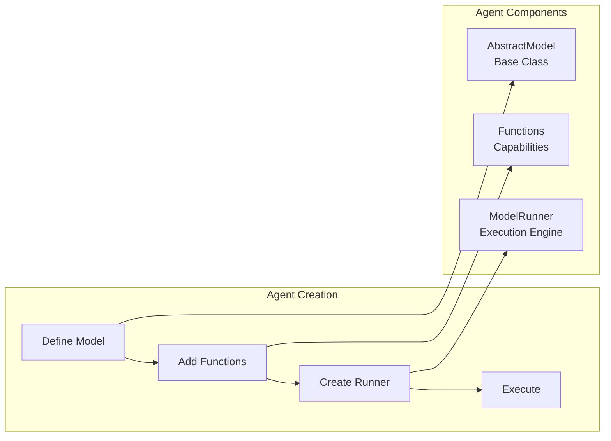

# Building Agents from Scratch

## Table of Contents
1. [Introduction](#introduction)
2. [Agent Fundamentals](#agent-fundamentals)
3. [Your First Agent](#your-first-agent)
4. [Function Integration](#function-integration)
5. [Agent Storage & Loading](#agent-storage--loading)
6. [Advanced Patterns](#advanced-patterns)
7. [Production Best Practices](#production-best-practices)
8. [Real-World Examples](#real-world-examples)

## Introduction

Agents in Percolate are AI systems built on Pydantic models that can perceive their environment, make decisions, and take actions through functions. This guide covers building agents from scratch using the actual Percolate API.



## Agent Fundamentals

### Core Concepts

**1. Agent Definition**
Agents inherit from `AbstractModel` and define their behavior through:
- System prompt (docstring)
- Functions (class methods)
- Configuration (fields)

**2. Agent Execution**
The `p8.Agent()` function creates a `ModelRunner` that:
- Loads the agent model
- Discovers available functions
- Handles LLM interaction
- Manages user context and security

**3. Function Discovery**
Functions are discovered automatically from class methods decorated with `@classmethod`.

## Your First Agent

### Step 1: Define the Agent Model

```python
import percolate as p8
from percolate.models import AbstractModel
from typing import List

class WeatherAgent(AbstractModel):
    """I provide weather information for any location. 
    I can get current conditions, forecasts, and weather alerts."""
    
    # Optional configuration fields
    default_units: str = "celsius"
    
    @classmethod
    def get_weather(cls, location: str, units: str = "celsius"):
        """Get current weather for a location
        
        Args:
            location: City name or coordinates
            units: Temperature units (celsius/fahrenheit)
        """
        # Implementation would call a weather API
        return {
            "location": location,
            "temperature": 22,
            "condition": "Sunny",
            "units": units
        }
    
    @classmethod
    def get_forecast(cls, location: str, days: int = 5):
        """Get weather forecast
        
        Args:
            location: City name or coordinates  
            days: Number of days to forecast (1-7)
        """
        # Implementation would get forecast data
        return {
            "location": location,
            "forecast": [
                {"day": "Today", "high": 25, "low": 18},
                {"day": "Tomorrow", "high": 23, "low": 16}
            ]
        }
```

### Step 2: Create and Use the Agent

```python
# Create the agent runner
agent = p8.Agent(WeatherAgent)

# Use the agent
response = agent.run("What's the weather like in London?")
print(response)

# Stream responses
for chunk in agent.stream("Give me a 5-day forecast for Tokyo"):
    print(chunk, end="")
```

## Function Integration

### Function Patterns

**1. Simple Functions**
```python
class DataAgent(AbstractModel):
    """I help with data analysis and retrieval."""
    
    @classmethod
    def search_data(cls, query: str, limit: int = 10):
        """Search for data matching the query"""
        # Use repository pattern
        from percolate.models import Resources
        repo = p8.repository(Resources)
        return repo.select(content__ilike=f"%{query}%")[:limit]
```

**2. Database Integration**
```python
class CustomerAgent(AbstractModel):
    """I manage customer information and interactions."""
    
    @classmethod  
    def find_customer(cls, email: str):
        """Find customer by email address"""
        from percolate.models import User
        repo = p8.repository(User)
        results = repo.select(email=email)
        return results[0] if results else None
    
    @classmethod
    def update_customer(cls, customer_id: str, **updates):
        """Update customer information"""
        from percolate.models import User
        repo = p8.repository(User)
        repo.update_records([{"id": customer_id, **updates}])
        return f"Updated customer {customer_id}"
```

**3. External API Integration**
```python
class WebAgent(AbstractModel):
    """I can search the web and fetch information from URLs."""
    
    @classmethod
    def web_search(cls, query: str, max_results: int = 10):
        """Search the web for information"""
        import httpx
        
        # Use Percolate's web search integration
        response = httpx.post("http://localhost:5008/x/web/search", json={
            "query": query,
            "max_results": max_results
        })
        return response.json()
    
    @classmethod
    def fetch_webpage(cls, url: str, to_markdown: bool = True):
        """Fetch and optionally convert webpage to markdown"""
        import httpx
        
        response = httpx.post("http://localhost:5008/x/web/fetch", json={
            "url": url,
            "to_markdown": to_markdown
        })
        return response.json()
```

## Agent Storage & Loading

### Saving Agents to Database

```python
# Save agent definition to database for reuse
from percolate.models.p8.types import Agent

agent_metadata = Agent(
    name="weather_agent",
    description="Weather information provider",
    spec={
        "model_name": "WeatherAgent",
        "namespace": "weather",
        "functions": ["get_weather", "get_forecast"]
    },
    metadata={
        "version": "1.0",
        "author": "Your Name"
    }
)

# Save to database
repo = p8.repository(Agent)
repo.update_records([agent_metadata])
```

### Loading Agents

```python
# Load agent from database
agent_model = Agent.load("weather_agent")

# Create runner
agent = p8.Agent(agent_model)

# Use the loaded agent
response = agent.run("What's the weather forecast?")
```
