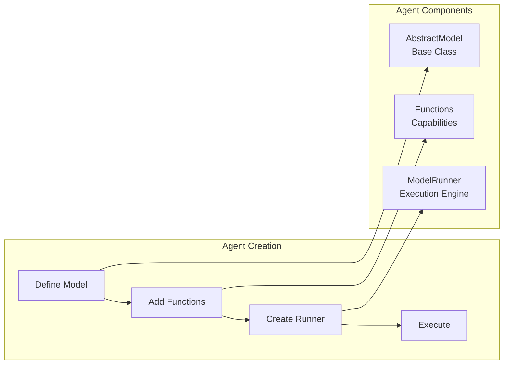
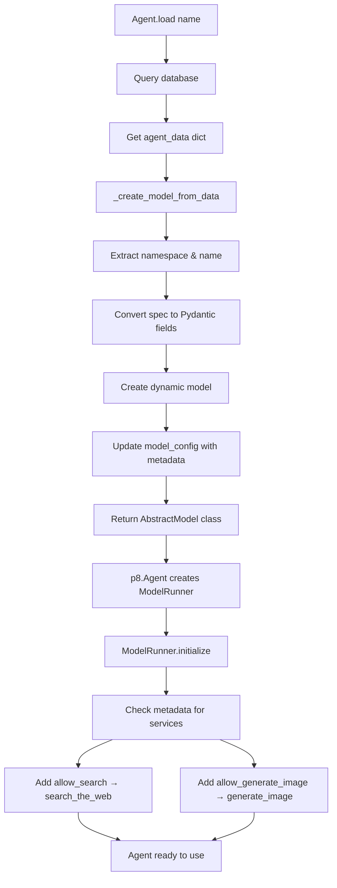

# Building Agents from Scratch

## Table of Contents
1. [Introduction](#introduction)
2. [Agent Fundamentals](#agent-fundamentals)
3. [Your First Agent](#your-first-agent)
4. [Function Integration](#function-integration)
5. [Agent Storage & Loading](#agent-storage--loading)
6. [Advanced Patterns](#advanced-patterns)
7. [Production Best Practices](#production-best-practices)
8. [Real-World Examples](#real-world-examples)

## Introduction

Agents in Percolate are AI systems built on Pydantic models that can perceive their environment, make decisions, and take actions through functions. This guide covers building agents from scratch using the actual Percolate API.


```mermaid
graph LR
    subgraph "Agent Creation"
        A[Define Model] --> B[Add Functions]
        B --> C[Create Runner]
        C --> D[Execute]
    end
    
    subgraph "Agent Components"
        E[AbstractModel<br/>Base Class]
        F[Functions<br/>Capabilities]
        G[ModelRunner<br/>Execution Engine]
    end
    
    A --> E
    B --> F
    C --> G
```

## Agent Fundamentals

### Core Concepts

**1. Agent Definition**
Agents inherit from `AbstractModel` and define their behavior through:
- System prompt (docstring)
- Functions (class methods)
- Configuration (fields)

**2. Agent Execution**
The `p8.Agent()` function creates a `ModelRunner` that:
- Loads the agent model
- Discovers available functions
- Handles LLM interaction
- Manages user context and security

**3. Function Discovery**
Functions are discovered automatically from class methods decorated with `@classmethod`.

## Your First Agent

### Step 1: Define the Agent Model

```python
import percolate as p8
from percolate.models import AbstractModel
from typing import List

class WeatherAgent(AbstractModel):
    """I provide weather information for any location. 
    I can get current conditions, forecasts, and weather alerts."""
    
    # Optional configuration fields
    default_units: str = "celsius"
    
    @classmethod
    def get_weather(cls, location: str, units: str = "celsius"):
        """Get current weather for a location
        
        Args:
            location: City name or coordinates
            units: Temperature units (celsius/fahrenheit)
        """
        # Implementation would call a weather API
        return {
            "location": location,
            "temperature": 22,
            "condition": "Sunny",
            "units": units
        }
    
    @classmethod
    def get_forecast(cls, location: str, days: int = 5):
        """Get weather forecast
        
        Args:
            location: City name or coordinates  
            days: Number of days to forecast (1-7)
        """
        # Implementation would get forecast data
        return {
            "location": location,
            "forecast": [
                {"day": "Today", "high": 25, "low": 18},
                {"day": "Tomorrow", "high": 23, "low": 16}
            ]
        }
```

### Step 2: Create and Use the Agent

```python
# Create the agent runner
agent = p8.Agent(WeatherAgent)

# Use the agent
response = agent.run("What's the weather like in London?")
print(response)

# Stream responses
for chunk in agent.stream("Give me a 5-day forecast for Tokyo"):
    print(chunk, end="")
```

## Function Integration

### Function Patterns

**1. Simple Functions**
```python
class DataAgent(AbstractModel):
    """I help with data analysis and retrieval."""
    
    @classmethod
    def search_data(cls, query: str, limit: int = 10):
        """Search for data matching the query"""
        # Use repository pattern
        from percolate.models import Resources
        repo = p8.repository(Resources)
        return repo.select(content__ilike=f"%{query}%")[:limit]
```

**2. Database Integration**
```python
class CustomerAgent(AbstractModel):
    """I manage customer information and interactions."""
    
    @classmethod  
    def find_customer(cls, email: str):
        """Find customer by email address"""
        from percolate.models import User
        repo = p8.repository(User)
        results = repo.select(email=email)
        return results[0] if results else None
    
    @classmethod
    def update_customer(cls, customer_id: str, **updates):
        """Update customer information"""
        from percolate.models import User
        repo = p8.repository(User)
        repo.update_records([{"id": customer_id, **updates}])
        return f"Updated customer {customer_id}"
```

**3. External API Integration**
```python
class WebAgent(AbstractModel):
    """I can search the web and fetch information from URLs."""
    
    @classmethod
    def web_search(cls, query: str, max_results: int = 10):
        """Search the web for information"""
        import httpx
        
        # Use Percolate's web search integration
        response = httpx.post("http://localhost:5008/x/web/search", json={
            "query": query,
            "max_results": max_results
        })
        return response.json()
    
    @classmethod
    def fetch_webpage(cls, url: str, to_markdown: bool = True):
        """Fetch and optionally convert webpage to markdown"""
        import httpx
        
        response = httpx.post("http://localhost:5008/x/web/fetch", json={
            "url": url,
            "to_markdown": to_markdown
        })
        return response.json()
```

## Agent Storage & Loading

### Creating Agents via Entity API

Agents can be created and persisted via the `/entities/` API endpoint. This allows dynamic agent creation without writing Python code.

#### Agent Model Structure

The `Agent` model in Percolate has the following structure:

```python
class Agent(AbstractEntityModel):
    id: Optional[uuid.UUID | str] = None  # Auto-generated from name
    name: str  # Agent name (namespace.name format)
    category: Optional[str] = None  # For filtering/organization
    description: str  # System prompt for the agent
    spec: Optional[dict] = {}  # JSON Schema for agent data model
    functions: Optional[dict] = {}  # Function definitions
    metadata: Optional[dict] = {}  # Custom metadata (allow_search, etc.)
```

#### Creating an Agent via API

**Endpoint:** `POST /entities/`

**Query Parameters:**
- `make_discoverable` (boolean, default: false) - Register agent as a discoverable function
- `make_public` (boolean, default: false) - Create a public agent accessible to all users

**User-Bound vs Public Agents:**

By default, agents are **user-bound** - the ID is generated from both the agent name and user ID. This means:
- Each user can have their own agent with the same name
- Users can only see and modify their own agents (via RLS policies)
- Agent ID: `hash(name + user_id)`

With `make_public=true`, agents are **public**:
- The ID is generated from name only
- Public agents are accessible to all users
- **Protected from overwrites**: Users with role level ≤ 1 cannot overwrite existing public agents (returns 409 conflict)
- **Admin override**: Users with role level > 1 can overwrite existing public agents
- Agent ID: `hash(name)`

**Basic Example (User-Bound Agent):**

```bash
curl -X POST "http://localhost:5008/entities/?make_discoverable=true" \
  -H "Content-Type: application/json" \
  -H "Authorization: Bearer YOUR_TOKEN" \
  -d '{
    "entity_type": "Agent",
    "name": "support.CustomerAgent",
    "category": "customer_service",
    "description": "I help customers with their inquiries and can access order information, process returns, and escalate complex issues.",
    "metadata": {
      "allow_search": true,
      "version": "1.0.0"
    }
  }'
```

**Public Agent Example:**

```bash
curl -X POST "http://localhost:5008/entities/?make_public=true&make_discoverable=true" \
  -H "Content-Type: application/json" \
  -H "Authorization: Bearer YOUR_TOKEN" \
  -d '{
    "entity_type": "Agent",
    "name": "public.SharedResearcher",
    "category": "research",
    "description": "A public research agent accessible to all users.",
    "metadata": {
      "allow_search": true,
      "version": "1.0.0"
    }
  }'
```

**Response:**

```json
{
  "id": "550e8400-e29b-41d4-a716-446655440000",
  "name": "support.CustomerAgent",
  "category": "customer_service",
  "description": "I help customers with their inquiries...",
  "spec": {},
  "functions": {},
  "metadata": {
    "allow_search": true,
    "version": "1.0.0"
  }
}
```

### Agent Metadata: Enabling Built-in Services

Percolate provides built-in services that can be enabled for any agent via metadata. These services add powerful capabilities without requiring custom code.

#### Available Services

You can list all available services programmatically:

```bash
GET /tools/services
```

**Current Built-in Services:**

1. **Web Search** (`allow_search: true`)
   - Enables the `search_the_web` function
   - Uses Tavily API for real-time web searches
   - Requires `TAVILY_API_KEY` environment variable
   - Perfect for agents that need current information

2. **Image Generation** (`allow_generate_image: true`)
   - Enables the `generate_image` function
   - Uses DALL-E 3 for image creation
   - Automatically uploads to S3 with presigned URLs
   - Great for creative or visual agents

#### Example: Agent with Web Search

```json
{
  "entity_type": "Agent",
  "name": "research.ResearchAssistant",
  "description": "I research topics on the web and provide comprehensive summaries with citations.",
  "metadata": {
    "allow_search": true
  }
}
```

When this agent is loaded and run, it will automatically have access to `search_the_web(query, max_results)`.

#### Example: Agent with Multiple Services

```json
{
  "entity_type": "Agent",
  "name": "creative.DesignAgent",
  "description": "I help with creative design tasks including research and image generation.",
  "metadata": {
    "allow_search": true,
    "allow_generate_image": true,
    "version": "2.0.0"
  }
}
```

### How Metadata Services Work

When an agent is loaded via `Agent.load()`, the metadata is stored in the model's `model_config`:

```python
# In Agent._create_model_from_data()
if agent_data.get("metadata"):
    model.model_config.update(agent_data["metadata"])
```

The `ModelRunner` checks this config during initialization:

```python
# In ModelRunner.initialize()
if self._agent_allows_web_search():
    self._function_manager.add_function(self.search_the_web)

if self._agent_allows_image_generation():
    self._function_manager.add_function(self.generate_image)
```

This approach ensures:
- ✅ Metadata is persisted in the database
- ✅ Services are enabled dynamically at runtime
- ✅ No code changes needed to add capabilities
- ✅ Works with Pydantic model validation

### Adding External Functions

The `functions` field allows agents to reference external functions that can be activated at runtime. These are simply name-description pairs that tell the agent what functions are available and how to use them.

#### How Functions Work

Functions in the `functions` field are **references**, not implementations. The format is:

```python
functions = {
    "function_name": "Description of how to use this function"
}
```

When the agent loads, these function names are included in the agent's system prompt. The agent can then use `activate_functions_by_name(["function_name"])` to load them at runtime.

#### Discovering Available Functions

List all available functions in the database:

```bash
GET /tools/functions?limit=100
```

This returns functions that have been registered and can be activated by agents.

#### Example: Agent with External Functions

```json
{
  "entity_type": "Agent",
  "name": "research.TaskAgent",
  "description": "I help with research tasks and can execute research iterations.",
  "functions": {
    "post_tasks_": "Used to save tasks by posting the task object. Its good practice to first search for a task of a similar name before saving in case of duplicates",
    "post_tasks_research_execute": "Post the ResearchIteration object to execute a research plan"
  },
  "metadata": {
    "allow_search": true,
    "version": "1.0.0"
  }
}
```

#### How Agents Use Functions

When the agent is loaded:

1. The `functions` dict is stored in `model_config['functions']`
2. Function names and descriptions are included in the system prompt
3. The agent can see these are available tools
4. When needed, the agent calls `activate_functions_by_name(["post_tasks_"])`
5. The FunctionManager loads the actual function implementation from the database
6. The agent can then invoke the function

**Example from code:**

```python
@classmethod
def get_model_functions(cls):
    """Define available external functions for this agent"""
    return {
        "post_tasks_": "Used to save tasks by posting the task object. Its good practice to first search for a task of a similar name before saving in case of duplicates"
    }
```

This is the pattern used in Percolate core models like `Task` and `ResearchIteration`.

### Loading and Using Agents

#### Loading via Python

```python
from percolate.models.p8 import Agent
import percolate as p8

# Load agent from database by name
agent_model = Agent.load("support.CustomerAgent")

# Create a runner
agent = p8.Agent(agent_model)

# Use the agent
response = agent.run("How can I return a product?")
print(response)
```

#### The Agent Loading Flow


```mermaid
graph TD
    A[Agent.load name] --> B[Query database]
    B --> C[Get agent_data dict]
    C --> D[_create_model_from_data]
    D --> E[Extract namespace & name]
    E --> F[Convert spec to Pydantic fields]
    F --> G[Create dynamic model]
    G --> H[Update model_config with metadata]
    H --> I[Return AbstractModel class]
    I --> J[p8.Agent creates ModelRunner]
    J --> K[ModelRunner.initialize]
    K --> L[Check metadata for services]
    L --> M[Add allow_search → search_the_web]
    L --> N[Add allow_generate_image → generate_image]
    M --> O[Agent ready to use]
    N --> O
```

#### What Happens When You Load an Agent

1. **Database Query**: `Agent.load("support.CustomerAgent")` queries the database
2. **Data Extraction**: Returns agent data as a dictionary
3. **Model Creation**: `_create_model_from_data()` creates a dynamic Pydantic model
4. **Metadata Application**: The `metadata` field is merged into `model_config`
5. **Runner Initialization**: `p8.Agent()` creates a `ModelRunner`
6. **Service Activation**: Services in metadata are checked and enabled
7. **Function Registration**: Both built-in and custom functions are registered

### Updating Agents

Update an existing agent by posting with the same name:

```python
updated_agent = Agent(
    name="support.CustomerAgent",
    description="Updated description with more capabilities",
    metadata={
        "allow_search": true,
        "allow_generate_image": true,  # Added new capability
        "version": "1.1.0"
    }
)

repo = p8.repository(Agent)
repo.update_records([updated_agent])
```

### Making Agents Discoverable

Use the `make_discoverable=true` query parameter to register the agent as a searchable function:

```bash
POST /entities/?make_discoverable=true
```

This creates a `Function` entity with:
- Name: `{namespace}_{agent_name}_run`
- Proxy URI: `p8agent/{namespace.agent_name}`
- Makes the agent searchable via semantic search

Other agents can then find and activate this agent using the `help()` or `activate_functions_by_name()` functions.

### Complete Example: Creating and Using an Agent

#### Example 1: Research Agent with Web Search

```bash
# 1. Create agent via API
curl -X POST "http://localhost:5008/entities/?make_discoverable=true" \
  -H "Content-Type: application/json" \
  -H "Authorization: Bearer YOUR_TOKEN" \
  -d '{
    "entity_type": "Agent",
    "name": "research.WebResearcher",
    "category": "research",
    "description": "I research topics on the web, synthesize information from multiple sources, and provide well-cited summaries. I use search_the_web to find current information.",
    "metadata": {
      "allow_search": true,
      "version": "1.0.0"
    }
  }'
```

```python
# 2. Load and use in Python
from percolate.models.p8 import Agent
import percolate as p8

# Load the agent
researcher = Agent.load("research.WebResearcher")

# Create runner
agent = p8.Agent(researcher)

# Use it - the agent now has search_the_web available
response = agent.run("Research the latest developments in quantum computing")
print(response)
```

#### Example 2: Task Agent with External Functions

```json
{
  "entity_type": "Agent",
  "name": "tasks.TaskManager",
  "category": "productivity",
  "description": "I help manage tasks and research projects. I can save tasks and execute research plans.",
  "functions": {
    "post_tasks_": "Save a task by posting the task object. Search for similar tasks first to avoid duplicates.",
    "post_tasks_research_execute": "Execute a research plan by posting a ResearchIteration object"
  },
  "metadata": {
    "allow_search": true,
    "version": "1.0.0"
  }
}
```

When this agent runs, it will:
1. Have `search_the_web` available (from `allow_search` metadata)
2. Know about `post_tasks_` and `post_tasks_research_execute` functions
3. Can activate these functions using `activate_functions_by_name(["post_tasks_"])` when needed

### Verification and Testing

#### Verify Agent was Created

```python
# List all agents
agents = p8.repository(Agent).select()
print([a['name'] for a in agents])

# Get specific agent
agent_data = p8.repository(Agent).select(name="research.WebResearcher")
print(agent_data[0])
```

#### Verify Metadata is Preserved

```python
# Load agent
loaded = Agent.load("research.WebResearcher")

# Check model_config
print(loaded.model_config)
# Should show: {'allow_search': True, 'version': '1.0.0', ...}

# Create runner and verify functions
agent = p8.Agent(loaded)
print('search_the_web' in agent.functions)  # Should be True
```

### Best Practices

1. **Naming Convention**: Use `namespace.AgentName` format (e.g., `support.CustomerAgent`)
2. **Descriptive Prompts**: The `description` field is the system prompt - make it detailed
3. **Version Metadata**: Track versions in metadata for easier debugging
4. **Enable Services Carefully**: Only enable services the agent needs (cost considerations)
5. **Test After Creation**: Always verify agents load correctly before deploying
6. **Make Discoverable**: Use `make_discoverable=true` for agents that should be callable by other agents
