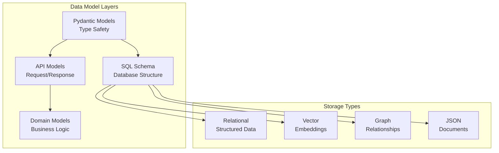

# Data Models Guide

## Table of Contents
1. [Overview](#overview)
2. [Core Type System](#core-type-system)
3. [Primary Data Models](#primary-data-models)
4. [Relationship Models](#relationship-models)
5. [Embedding & Vector Models](#embedding--vector-models)
6. [Security Models](#security-models)
7. [Schema Evolution](#schema-evolution)
8. [Model Validation](#model-validation)
9. [Best Practices](#best-practices)
10. [Reference Implementation](#reference-implementation)

## Overview

Percolate's data model architecture is built on PostgreSQL with extensions for vector, graph, and document storage. The system uses Pydantic for type safety and validation, ensuring data integrity across all layers.



## Core Type System

### Base Model

```python
from typing import Optional, List, Dict, Any
from datetime import datetime
from pydantic import BaseModel, Field, ConfigDict
from sqlalchemy import Column, String, DateTime, JSON
from percolate import DefaultEmbeddingField

class PercolateBaseModel(BaseModel):
    """Base model for all Percolate data types"""
    
    model_config = ConfigDict(
        from_attributes=True,
        validate_assignment=True,
        arbitrary_types_allowed=True,
        json_schema_extra={
            "example": {}
        }
    )
    
    # Common fields
    id: Optional[str] = Field(None, description="Unique identifier")
    created_at: Optional[datetime] = Field(None, description="Creation timestamp")
    updated_at: Optional[datetime] = Field(None, description="Last update timestamp")
    created_by: Optional[str] = Field(None, description="User who created this")
    metadata: Optional[Dict[str, Any]] = Field(default_factory=dict)
    
    # Embedding support
    embedding: Optional[List[float]] = Field(None, exclude=True)
    embedding_model: Optional[str] = Field(None, description="Model used for embedding")
    
    def generate_embedding(self, field: str = "description"):
        """Generate embedding for specified field"""
        pass
```

### Type Definitions

```python
# types.py
from enum import Enum
from typing import Union, Literal

# Custom types
EntityId = str
UserId = str
SessionId = str
Embedding = List[float]

# Enums
class ModelProvider(str, Enum):
    OPENAI = "openai"
    ANTHROPIC = "anthropic"
    GOOGLE = "google"
    OLLAMA = "ollama"
    CUSTOM = "custom"

class FunctionStatus(str, Enum):
    ACTIVE = "active"
    DISABLED = "disabled"
    DEPRECATED = "deprecated"
    ERROR = "error"

class ResourceType(str, Enum):
    DOCUMENT = "document"
    CODE = "code"
    IMAGE = "image"
    AUDIO = "audio"
    VIDEO = "video"
    DATASET = "dataset"

# Type aliases
JsonSchema = Dict[str, Any]
FunctionParameters = Dict[str, Any]
QueryResult = Union[Dict[str, Any], List[Dict[str, Any]]]
```

## Primary Data Models

### 1. Function Model

```python
class Function(PercolateBaseModel):
    """External function that can be called by agents"""
    
    # Identity
    name: str = Field(..., description="Unique function name")
    description: str = DefaultEmbeddingField(description="What this function does")
    
    # API Configuration
    endpoint: Optional[str] = Field(None, description="API endpoint URL")
    method: str = Field("POST", description="HTTP method")
    auth_type: Optional[str] = Field(None, description="Authentication type")
    auth_config: Optional[Dict[str, Any]] = Field(None, description="Auth configuration")
    
    # Function signature
    parameters: JsonSchema = Field(..., description="JSON Schema for parameters")
    returns: JsonSchema = Field(..., description="JSON Schema for return value")
    
    # Behavior
    timeout: int = Field(30, description="Timeout in seconds")
    retry_config: Optional[Dict[str, Any]] = Field(None)
    cache_ttl: Optional[int] = Field(None, description="Cache TTL in seconds")
    
    # Status
    status: FunctionStatus = Field(FunctionStatus.ACTIVE)
    error_count: int = Field(0)
    last_error: Optional[str] = Field(None)
    last_used: Optional[datetime] = Field(None)
    
    # Permissions
    allowed_users: Optional[List[UserId]] = Field(None)
    allowed_roles: Optional[List[str]] = Field(None)
    
    # SQL table mapping
    __tablename__ = "functions"
    
    class Config:
        json_schema_extra = {
            "example": {
                "name": "get_weather",
                "description": "Get current weather for a location",
                "endpoint": "https://api.weather.com/current",
                "parameters": {
                    "type": "object",
                    "properties": {
                        "location": {"type": "string"},
                        "units": {"type": "string", "enum": ["metric", "imperial"]}
                    },
                    "required": ["location"]
                }
            }
        }
```

### 2. Agent Model

```python
class Agent(PercolateBaseModel):
    """AI agent with specific capabilities"""
    
    # Identity
    name: str = Field(..., description="Unique agent name")
    description: str = DefaultEmbeddingField(description="Agent purpose and capabilities")
    avatar_url: Optional[str] = Field(None)
    
    # Behavior configuration
    system_prompt: str = Field(..., description="System instructions")
    model: str = Field("gpt-4", description="Default model")
    temperature: float = Field(0.7, ge=0, le=2)
    max_tokens: Optional[int] = Field(None)
    
    # Functions
    functions: List[str] = Field(default_factory=list, description="Available function names")
    function_calling: Literal["auto", "none", "required"] = Field("auto")
    parallel_functions: bool = Field(True)
    
    # Context
    context_window: int = Field(8192)
    memory_type: Optional[str] = Field(None, description="Memory strategy")
    retrieval_config: Optional[Dict[str, Any]] = Field(None)
    
    # Guardrails
    content_filter: Optional[Dict[str, Any]] = Field(None)
    rate_limit: Optional[Dict[str, Any]] = Field(None)
    max_iterations: int = Field(10, description="Max reasoning steps")
    
    # Analytics
    total_interactions: int = Field(0)
    success_rate: Optional[float] = Field(None)
    avg_response_time: Optional[float] = Field(None)
    
    __tablename__ = "agents"
```

### 3. Session Model

```python
class Session(PercolateBaseModel):
    """User session for state management"""
    
    # Identity
    session_id: SessionId = Field(..., description="Unique session ID")
    user_id: Optional[UserId] = Field(None)
    device_id: Optional[str] = Field(None)
    
    # Metadata
    ip_address: Optional[str] = Field(None)
    user_agent: Optional[str] = Field(None)
    referrer: Optional[str] = Field(None)
    
    # State
    data: Dict[str, Any] = Field(default_factory=dict)
    context: Dict[str, Any] = Field(default_factory=dict)
    
    # Lifecycle
    expires_at: datetime = Field(...)
    last_activity: datetime = Field(...)
    is_active: bool = Field(True)
    
    # Security
    csrf_token: Optional[str] = Field(None)
    permissions: List[str] = Field(default_factory=list)
    
    __tablename__ = "sessions"
```

### 4. AIResponse Model

```python
class AIResponse(PercolateBaseModel):
    """Record of AI interactions"""
    
    # Request info
    session_id: SessionId = Field(...)
    user_id: Optional[UserId] = Field(None)
    agent_id: Optional[str] = Field(None)
    
    # Prompt and response
    prompt: str = Field(..., description="User prompt")
    response: str = Field(..., description="AI response")
    
    # Model info
    model: str = Field(...)
    temperature: float = Field(...)
    tokens_prompt: int = Field(...)
    tokens_completion: int = Field(...)
    
    # Function calls
    functions_called: Optional[List[Dict[str, Any]]] = Field(None)
    function_results: Optional[List[Dict[str, Any]]] = Field(None)
    
    # Performance
    latency_ms: int = Field(..., description="Response time in milliseconds")
    streaming: bool = Field(False)
    
    # Quality
    feedback_rating: Optional[int] = Field(None, ge=1, le=5)
    feedback_text: Optional[str] = Field(None)
    
    # Error handling
    error: Optional[str] = Field(None)
    retry_count: int = Field(0)
    
    __tablename__ = "ai_responses"
```

### 5. Resource Model

```python
class Resource(PercolateBaseModel):
    """Content resource for knowledge base"""
    
    # Identity
    name: str = Field(..., description="Resource name")
    description: str = DefaultEmbeddingField()
    resource_type: ResourceType = Field(...)
    
    # Content
    content: Optional[str] = Field(None, description="Text content")
    content_url: Optional[str] = Field(None, description="External content URL")
    content_hash: Optional[str] = Field(None, description="Content hash for dedup")
    
    # Storage
    storage_path: Optional[str] = Field(None)
    size_bytes: Optional[int] = Field(None)
    mime_type: Optional[str] = Field(None)
    
    # Chunking
    chunk_size: int = Field(1000)
    chunk_overlap: int = Field(100)
    chunks: Optional[List["ResourceChunk"]] = Field(None)
    
    # Metadata
    source_url: Optional[str] = Field(None)
    author: Optional[str] = Field(None)
    published_date: Optional[datetime] = Field(None)
    tags: List[str] = Field(default_factory=list)
    
    # Processing
    processed: bool = Field(False)
    processing_error: Optional[str] = Field(None)
    embedding_status: Optional[str] = Field(None)
    
    # Access control
    visibility: Literal["public", "private", "restricted"] = Field("private")
    allowed_users: Optional[List[UserId]] = Field(None)
    allowed_groups: Optional[List[str]] = Field(None)
    
    __tablename__ = "resources"

class ResourceChunk(PercolateBaseModel):
    """Chunk of a larger resource"""
    
    resource_id: str = Field(...)
    chunk_index: int = Field(...)
    content: str = Field(...)
    embedding: Optional[Embedding] = Field(None)
    metadata: Dict[str, Any] = Field(default_factory=dict)
    
    __tablename__ = "resource_chunks"
```

## Relationship Models

### 1. Entity Model

```python
class Entity(PercolateBaseModel):
    """Named entity in the knowledge graph"""
    
    # Identity
    name: str = Field(..., description="Entity name")
    entity_type: str = Field(..., description="Type of entity")
    description: str = DefaultEmbeddingField()
    
    # Properties
    properties: Dict[str, Any] = Field(default_factory=dict)
    aliases: List[str] = Field(default_factory=list)
    
    # Graph relationships
    relationships: Optional[List["EntityRelationship"]] = Field(None)
    
    # Confidence
    confidence: float = Field(1.0, ge=0, le=1)
    source: Optional[str] = Field(None)
    
    __tablename__ = "entities"

class EntityRelationship(PercolateBaseModel):
    """Relationship between entities"""
    
    source_id: str = Field(...)
    target_id: str = Field(...)
    relationship_type: str = Field(...)
    properties: Dict[str, Any] = Field(default_factory=dict)
    confidence: float = Field(1.0)
    
    __tablename__ = "entity_relationships"
```

### 2. User Model

```python
class User(PercolateBaseModel):
    """User account and profile"""
    
    # Identity
    email: str = Field(..., description="Email address")
    username: Optional[str] = Field(None)
    full_name: Optional[str] = Field(None)
    
    # Authentication
    auth_provider: str = Field("local")
    auth_id: str = Field(...)
    is_verified: bool = Field(False)
    
    # Profile
    avatar_url: Optional[str] = Field(None)
    bio: Optional[str] = Field(None)
    preferences: Dict[str, Any] = Field(default_factory=dict)
    
    # Context and memory
    context: Dict[str, Any] = Field(default_factory=dict)
    memory_enabled: bool = Field(True)
    memory_window: int = Field(30, description="Days to retain memory")
    
    # Permissions
    roles: List[str] = Field(default_factory=list)
    permissions: List[str] = Field(default_factory=list)
    api_keys: Optional[List["APIKey"]] = Field(None)
    
    # Quotas
    daily_token_limit: Optional[int] = Field(None)
    monthly_token_limit: Optional[int] = Field(None)
    tokens_used_today: int = Field(0)
    tokens_used_month: int = Field(0)
    
    # Status
    is_active: bool = Field(True)
    last_login: Optional[datetime] = Field(None)
    
    __tablename__ = "users"
```

## Embedding & Vector Models

### 1. Embedding Configuration

```python
class EmbeddingConfig(PercolateBaseModel):
    """Configuration for embedding generation"""
    
    model_name: str = Field("text-embedding-3-small")
    dimensions: int = Field(1536)
    normalize: bool = Field(True)
    batch_size: int = Field(100)
    
    # Chunking
    chunk_size: int = Field(1000)
    chunk_overlap: int = Field(100)
    separator: str = Field("\n\n")
    
    # Processing
    preprocess: bool = Field(True)
    remove_stopwords: bool = Field(False)
    language: str = Field("en")

class EmbeddingField(Field):
    """Field that automatically generates embeddings"""
    
    def __init__(self, source_field: str, **kwargs):
        self.source_field = source_field
        super().__init__(**kwargs)
    
    def generate(self, instance):
        """Generate embedding from source field"""
        text = getattr(instance, self.source_field)
        return generate_embedding(text)
```

### 2. Vector Search Models

```python
class VectorSearchRequest(BaseModel):
    """Request for vector similarity search"""
    
    query: Union[str, Embedding] = Field(..., description="Query text or embedding")
    collection: Optional[str] = Field(None, description="Collection to search")
    limit: int = Field(10, ge=1, le=1000)
    threshold: float = Field(0.7, ge=0, le=1, description="Similarity threshold")
    
    # Filters
    filters: Optional[Dict[str, Any]] = Field(None)
    date_range: Optional[Dict[str, datetime]] = Field(None)
    
    # Options
    include_embeddings: bool = Field(False)
    include_metadata: bool = Field(True)
    rerank: bool = Field(False)

class VectorSearchResult(BaseModel):
    """Result from vector search"""
    
    id: str = Field(...)
    score: float = Field(..., description="Similarity score")
    content: str = Field(...)
    metadata: Dict[str, Any] = Field(default_factory=dict)
    embedding: Optional[Embedding] = Field(None)
    
    # Source info
    source_type: str = Field(...)
    source_id: str = Field(...)
    chunk_index: Optional[int] = Field(None)
```

## Security Models

### 1. API Key Model

```python
class APIKey(PercolateBaseModel):
    """API key for authentication"""
    
    # Identity
    key_hash: str = Field(..., description="Hashed API key")
    key_prefix: str = Field(..., description="Key prefix for identification")
    name: str = Field(..., description="Key name/description")
    
    # Ownership
    user_id: UserId = Field(...)
    
    # Permissions
    scopes: List[str] = Field(default_factory=list)
    allowed_ips: Optional[List[str]] = Field(None)
    allowed_origins: Optional[List[str]] = Field(None)
    
    # Limits
    rate_limit: Optional[Dict[str, int]] = Field(None)
    daily_limit: Optional[int] = Field(None)
    
    # Lifecycle
    expires_at: Optional[datetime] = Field(None)
    last_used: Optional[datetime] = Field(None)
    is_active: bool = Field(True)
    
    __tablename__ = "api_keys"
```

### 2. Permission Model

```python
class Permission(PercolateBaseModel):
    """Fine-grained permission"""
    
    resource_type: str = Field(..., description="Resource type")
    resource_id: Optional[str] = Field(None, description="Specific resource")
    action: str = Field(..., description="Action (read, write, delete, etc)")
    
    # Grant
    principal_type: Literal["user", "role", "api_key"] = Field(...)
    principal_id: str = Field(...)
    
    # Conditions
    conditions: Optional[Dict[str, Any]] = Field(None)
    expires_at: Optional[datetime] = Field(None)
    
    __tablename__ = "permissions"

class Role(PercolateBaseModel):
    """Role for grouping permissions"""
    
    name: str = Field(..., description="Role name")
    description: str = Field(...)
    permissions: List[str] = Field(default_factory=list)
    is_system: bool = Field(False)
    
    __tablename__ = "roles"
```

## Schema Evolution

### 1. Migration Support

```python
class SchemaVersion(PercolateBaseModel):
    """Track schema versions"""
    
    version: str = Field(..., description="Semantic version")
    description: str = Field(...)
    applied_at: datetime = Field(...)
    migrations: List[str] = Field(default_factory=list)
    
    __tablename__ = "schema_versions"

# Migration example
from alembic import op
import sqlalchemy as sa

def upgrade():
    """Add new field to agents table"""
    op.add_column('agents', sa.Column('reasoning_model', sa.String(), nullable=True))
    
def downgrade():
    """Remove field from agents table"""
    op.drop_column('agents', 'reasoning_model')
```

### 2. Backward Compatibility

```python
class ModelVersion:
    """Version-aware model loading"""
    
    @classmethod
    def from_dict(cls, data: Dict[str, Any], version: str = "latest"):
        """Load model with version compatibility"""
        
        if version < "2.0.0":
            # Handle old format
            data = cls._migrate_v1_to_v2(data)
        
        return cls(**data)
    
    @staticmethod
    def _migrate_v1_to_v2(data: Dict[str, Any]) -> Dict[str, Any]:
        """Migrate v1 data to v2 format"""
        # Rename fields
        if "old_field" in data:
            data["new_field"] = data.pop("old_field")
        
        # Transform data
        if "status" in data and isinstance(data["status"], str):
            data["status"] = {"value": data["status"], "updated_at": None}
        
        return data
```

## Model Validation

### 1. Custom Validators

```python
from pydantic import validator, field_validator

class ValidatedModel(PercolateBaseModel):
    """Model with custom validation"""
    
    email: str
    age: int
    tags: List[str]
    
    @field_validator('email')
    @classmethod
    def validate_email(cls, v: str) -> str:
        """Validate email format"""
        if '@' not in v:
            raise ValueError('Invalid email address')
        return v.lower()
    
    @field_validator('age')
    @classmethod
    def validate_age(cls, v: int) -> int:
        """Validate age range"""
        if v < 0 or v > 150:
            raise ValueError('Age must be between 0 and 150')
        return v
    
    @field_validator('tags')
    @classmethod
    def validate_tags(cls, v: List[str]) -> List[str]:
        """Validate and clean tags"""
        # Remove duplicates and empty strings
        cleaned = list(set(tag.strip().lower() for tag in v if tag.strip()))
        
        # Validate tag format
        for tag in cleaned:
            if not tag.replace('-', '').replace('_', '').isalnum():
                raise ValueError(f'Invalid tag format: {tag}')
        
        return cleaned
```

### 2. Cross-Field Validation

```python
from pydantic import model_validator

class CrossValidatedModel(PercolateBaseModel):
    """Model with cross-field validation"""
    
    start_date: datetime
    end_date: datetime
    price: float
    discount_percentage: Optional[float] = None
    final_price: Optional[float] = None
    
    @model_validator(mode='after')
    def validate_dates(self) -> 'CrossValidatedModel':
        """Ensure end date is after start date"""
        if self.end_date <= self.start_date:
            raise ValueError('End date must be after start date')
        return self
    
    @model_validator(mode='after')
    def calculate_final_price(self) -> 'CrossValidatedModel':
        """Calculate final price if not provided"""
        if self.final_price is None and self.discount_percentage is not None:
            self.final_price = self.price * (1 - self.discount_percentage / 100)
        return self
```

## Best Practices

### 1. Model Design

```python
# Good: Clear, focused models
class Document(PercolateBaseModel):
    """A single document in the system"""
    title: str
    content: str
    author_id: UserId
    tags: List[str] = Field(default_factory=list)
    
    @property
    def word_count(self) -> int:
        """Calculate word count"""
        return len(self.content.split())

# Bad: Overly complex model
class BadModel(BaseModel):
    data: Dict[str, Any]  # Too generic
    field1: Optional[str]  # Unclear naming
    field2: Optional[str]  # No description
```

### 2. Performance Optimization

```python
class OptimizedModel(PercolateBaseModel):
    """Model optimized for performance"""
    
    # Lazy loading
    _expensive_data: Optional[Dict] = None
    
    @property
    def expensive_data(self) -> Dict:
        """Lazy load expensive data"""
        if self._expensive_data is None:
            self._expensive_data = self._load_expensive_data()
        return self._expensive_data
    
    # Exclude from serialization
    internal_state: Dict = Field(default_factory=dict, exclude=True)
    
    # Indexed fields
    search_field: str = Field(..., description="Indexed for search")
    
    class Config:
        # Enable ORM mode for SQLAlchemy
        from_attributes = True
        
        # Custom JSON encoders
        json_encoders = {
            datetime: lambda v: v.isoformat(),
            Decimal: lambda v: float(v)
        }
```

### 3. Testing Models

```python
import pytest
from pydantic import ValidationError

class TestModels:
    def test_user_creation(self):
        """Test user model creation"""
        user = User(
            email="test@example.com",
            auth_provider="google",
            auth_id="123456"
        )
        
        assert user.email == "test@example.com"
        assert user.is_active is True
        assert user.roles == []
    
    def test_validation_error(self):
        """Test validation errors"""
        with pytest.raises(ValidationError) as exc_info:
            User(email="invalid-email")  # Missing @ symbol
        
        errors = exc_info.value.errors()
        assert len(errors) > 0
        assert "email" in str(errors[0])
    
    def test_model_serialization(self):
        """Test model serialization"""
        agent = Agent(
            name="test-agent",
            description="Test agent",
            system_prompt="You are a test agent"
        )
        
        # To dict
        data = agent.model_dump()
        assert data["name"] == "test-agent"
        
        # To JSON
        json_str = agent.model_dump_json()
        assert "test-agent" in json_str
        
        # Exclude fields
        data_min = agent.model_dump(exclude={"created_at", "updated_at"})
        assert "created_at" not in data_min
```

## Reference Implementation

### Complete Example: Task Management System

```python
# models/task.py
from typing import Optional, List, Dict, Any
from datetime import datetime, timedelta
from enum import Enum
from pydantic import Field, field_validator, model_validator
from percolate import PercolateBaseModel, DefaultEmbeddingField

class TaskStatus(str, Enum):
    TODO = "todo"
    IN_PROGRESS = "in_progress"
    BLOCKED = "blocked"
    COMPLETED = "completed"
    CANCELLED = "cancelled"

class TaskPriority(str, Enum):
    LOW = "low"
    MEDIUM = "medium"
    HIGH = "high"
    CRITICAL = "critical"

class Task(PercolateBaseModel):
    """Task in the task management system"""
    
    # Identity
    title: str = Field(..., min_length=1, max_length=200)
    description: str = DefaultEmbeddingField(min_length=1)
    
    # Classification
    status: TaskStatus = Field(TaskStatus.TODO)
    priority: TaskPriority = Field(TaskPriority.MEDIUM)
    category: Optional[str] = Field(None)
    tags: List[str] = Field(default_factory=list)
    
    # Assignment
    assignee_id: Optional[UserId] = Field(None)
    team_id: Optional[str] = Field(None)
    
    # Timeline
    due_date: Optional[datetime] = Field(None)
    start_date: Optional[datetime] = Field(None)
    completed_at: Optional[datetime] = Field(None)
    estimated_hours: Optional[float] = Field(None, ge=0)
    actual_hours: Optional[float] = Field(None, ge=0)
    
    # Dependencies
    depends_on: List[str] = Field(default_factory=list)
    blocks: List[str] = Field(default_factory=list)
    
    # Metadata
    attachments: List[Dict[str, Any]] = Field(default_factory=list)
    comments_count: int = Field(0, ge=0)
    watchers: List[UserId] = Field(default_factory=list)
    
    __tablename__ = "tasks"
    
    @field_validator('tags')
    @classmethod
    def clean_tags(cls, v: List[str]) -> List[str]:
        """Clean and validate tags"""
        return list(set(tag.strip().lower() for tag in v if tag.strip()))
    
    @model_validator(mode='after')
    def validate_dates(self) -> 'Task':
        """Validate date relationships"""
        if self.start_date and self.due_date:
            if self.start_date > self.due_date:
                raise ValueError("Start date must be before due date")
        
        if self.status == TaskStatus.COMPLETED and not self.completed_at:
            self.completed_at = datetime.utcnow()
        
        return self
    
    @property
    def is_overdue(self) -> bool:
        """Check if task is overdue"""
        if not self.due_date or self.status == TaskStatus.COMPLETED:
            return False
        return datetime.utcnow() > self.due_date
    
    @property
    def days_until_due(self) -> Optional[int]:
        """Days until due date"""
        if not self.due_date:
            return None
        delta = self.due_date - datetime.utcnow()
        return delta.days
    
    def can_start(self, completed_tasks: List[str]) -> bool:
        """Check if task can be started"""
        return all(dep in completed_tasks for dep in self.depends_on)

class TaskComment(PercolateBaseModel):
    """Comment on a task"""
    
    task_id: str = Field(...)
    author_id: UserId = Field(...)
    content: str = Field(..., min_length=1)
    
    # Mentions
    mentions: List[UserId] = Field(default_factory=list)
    
    # Attachments
    attachments: List[Dict[str, Any]] = Field(default_factory=list)
    
    # Reactions
    reactions: Dict[str, List[UserId]] = Field(default_factory=dict)
    
    __tablename__ = "task_comments"

# Usage example
async def create_task_with_dependencies():
    # Create parent task
    parent = Task(
        title="Build new feature",
        description="Implement the new dashboard feature",
        priority=TaskPriority.HIGH,
        due_date=datetime.utcnow() + timedelta(days=14),
        estimated_hours=40
    )
    
    # Create subtasks
    subtasks = [
        Task(
            title="Design mockups",
            description="Create UI/UX mockups",
            priority=TaskPriority.HIGH,
            estimated_hours=8,
            depends_on=[parent.id]
        ),
        Task(
            title="Implement backend",
            description="Build API endpoints",
            priority=TaskPriority.MEDIUM,
            estimated_hours=16,
            depends_on=[parent.id]
        ),
        Task(
            title="Write tests",
            description="Unit and integration tests",
            priority=TaskPriority.MEDIUM,
            estimated_hours=8,
            depends_on=["implement_backend_id"]
        )
    ]
    
    # Save to database
    await save_tasks([parent] + subtasks)
```

## Summary

Percolate's data model system provides:

1. **Type Safety**: Pydantic models ensure data integrity
2. **Flexibility**: Support for relational, vector, graph, and document data
3. **Extensibility**: Easy to add new fields and models
4. **Performance**: Optimized for large-scale operations
5. **Security**: Built-in access control and validation

By following these patterns and best practices, you can build robust, scalable applications with Percolate's data models.