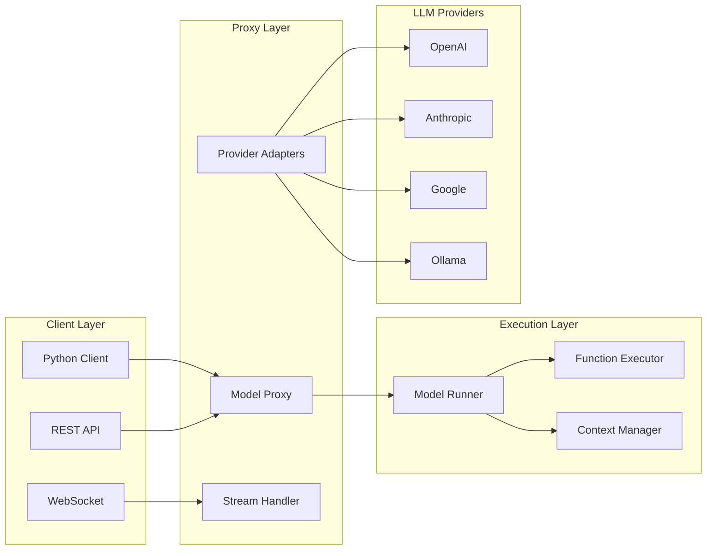

# Model Runners and Proxy Guide

## Table of Contents
1. [Overview](#overview)
2. [Model Runner Architecture](#model-runner-architecture)
3. [LLM Proxy System](#llm-proxy-system)
4. [Streaming Implementation](#streaming-implementation)
5. [Function Calling](#function-calling)
6. [Model Selection](#model-selection)
7. [Error Handling & Retries](#error-handling--retries)
8. [Performance Optimization](#performance-optimization)
9. [Monitoring & Observability](#monitoring--observability)
10. [Integration Examples](#integration-examples)

## Overview

The Model Runner and Proxy system in Percolate provides a unified interface for interacting with various LLM providers while managing agent execution, function calling, and streaming responses.



## Model Runner Architecture

### Core Components

```python
from typing import List, Dict, Any, Optional, AsyncIterator
from abc import ABC, abstractmethod
import asyncio
from percolate import Agent, Message, Function

class ModelRunner(ABC):
    """Abstract base class for model runners"""
    
    def __init__(self, agent: Agent):
        self.agent = agent
        self.context = {}
        self.message_stack: List[Message] = []
        self.function_registry = {}
        
    @abstractmethod
    async def run(self, prompt: str, **kwargs) -> str:
        """Execute the model with given prompt"""
        pass
    
    @abstractmethod
    async def stream(self, prompt: str, **kwargs) -> AsyncIterator[str]:
        """Stream responses from the model"""
        pass
    
    async def execute_with_functions(self, prompt: str) -> Dict[str, Any]:
        """Execute with function calling capabilities"""
        pass

class PercolateModelRunner(ModelRunner):
    """Main model runner implementation"""
    
    def __init__(self, agent: Agent, db_connection):
        super().__init__(agent)
        self.db = db_connection
        self.proxy = ModelProxy()
        self.max_iterations = agent.max_iterations or 10
        
    async def run(self, prompt: str, **kwargs) -> str:
        """Execute the agent with the given prompt"""
        
        # Initialize context
        await self._initialize_context(prompt)
        
        # Add user message
        self.message_stack.append(Message(role="user", content=prompt))
        
        # Execute reasoning loop
        for iteration in range(self.max_iterations):
            # Generate response
            response = await self._generate_response()
            
            # Check for function calls
            if response.function_calls:
                results = await self._execute_functions(response.function_calls)
                self.message_stack.append(Message(
                    role="function",
                    content=str(results)
                ))
                continue
            
            # Return final response
            return response.content
        
        raise Exception("Max iterations reached")
    
    async def stream(self, prompt: str, **kwargs) -> AsyncIterator[str]:
        """Stream responses from the model"""
        
        # Initialize
        await self._initialize_context(prompt)
        self.message_stack.append(Message(role="user", content=prompt))
        
        # Stream response
        async for chunk in self.proxy.stream_completion(
            messages=self.message_stack,
            model=self.agent.model,
            temperature=self.agent.temperature,
            functions=await self._get_available_functions()
        ):
            if chunk.type == "content":
                yield chunk.content
            elif chunk.type == "function_call":
                # Execute function
                result = await self._execute_function(chunk.function)
                # Continue streaming with result
                self.message_stack.append(Message(
                    role="function",
                    content=str(result)
                ))
    
    async def _initialize_context(self, prompt: str):
        """Initialize execution context"""
        
        # Load user context
        self.context["user"] = await self._get_user_context()
        
        # Discover relevant functions
        self.context["functions"] = await self._discover_functions(prompt)
        
        # Load relevant data
        self.context["knowledge"] = await self._search_knowledge(prompt)
        
        # Set system prompt
        system_prompt = self._build_system_prompt()
        self.message_stack = [Message(role="system", content=system_prompt)]
    
    async def _discover_functions(self, prompt: str) -> List[Function]:
        """Discover relevant functions for the prompt"""
        
        # Search function registry
        results = await self.db.search_functions(
            query=prompt,
            limit=10,
            threshold=0.7
        )
        
        # Filter by permissions
        allowed = []
        for func in results:
            if await self._check_function_permission(func):
                allowed.append(func)
        
        return allowed
    
    def _build_system_prompt(self) -> str:
        """Build enhanced system prompt with context"""
        
        base_prompt = self.agent.system_prompt
        
        # Add function information
        if self.context.get("functions"):
            base_prompt += "\n\nAvailable functions:\n"
            for func in self.context["functions"]:
                base_prompt += f"- {func.name}: {func.description}\n"
        
        # Add knowledge context
        if self.context.get("knowledge"):
            base_prompt += "\n\nRelevant information:\n"
            base_prompt += str(self.context["knowledge"])[:2000]
        
        return base_prompt
```

## LLM Proxy System

### Unified Interface

```python
from typing import Union, Optional, List, Dict, Any
import httpx
from abc import ABC, abstractmethod

class LLMProvider(ABC):
    """Abstract base for LLM providers"""
    
    @abstractmethod
    async def complete(self, messages: List[Message], **kwargs) -> str:
        pass
    
    @abstractmethod
    async def stream_complete(self, messages: List[Message], **kwargs) -> AsyncIterator[str]:
        pass

class OpenAIProvider(LLMProvider):
    """OpenAI API provider"""
    
    def __init__(self, api_key: str, base_url: str = "https://api.openai.com/v1"):
        self.api_key = api_key
        self.base_url = base_url
        self.client = httpx.AsyncClient(
            headers={"Authorization": f"Bearer {api_key}"}
        )
    
    async def complete(self, messages: List[Message], **kwargs) -> str:
        response = await self.client.post(
            f"{self.base_url}/chat/completions",
            json={
                "messages": [m.dict() for m in messages],
                "model": kwargs.get("model", "gpt-4"),
                "temperature": kwargs.get("temperature", 0.7),
                "max_tokens": kwargs.get("max_tokens"),
                "tools": kwargs.get("tools"),
                "tool_choice": kwargs.get("tool_choice", "auto")
            }
        )
        
        data = response.json()
        return data["choices"][0]["message"]["content"]
    
    async def stream_complete(self, messages: List[Message], **kwargs) -> AsyncIterator[str]:
        async with self.client.stream(
            "POST",
            f"{self.base_url}/chat/completions",
            json={
                "messages": [m.dict() for m in messages],
                "model": kwargs.get("model", "gpt-4"),
                "stream": True,
                **kwargs
            }
        ) as response:
            async for line in response.aiter_lines():
                if line.startswith("data: "):
                    data = line[6:]
                    if data == "[DONE]":
                        break
                    
                    chunk = json.loads(data)
                    if chunk["choices"][0]["delta"].get("content"):
                        yield chunk["choices"][0]["delta"]["content"]

class AnthropicProvider(LLMProvider):
    """Anthropic Claude provider"""
    
    def __init__(self, api_key: str):
        self.api_key = api_key
        self.client = httpx.AsyncClient(
            headers={
                "x-api-key": api_key,
                "anthropic-version": "2023-06-01"
            }
        )
    
    async def complete(self, messages: List[Message], **kwargs) -> str:
        # Convert to Anthropic format
        system = None
        anthropic_messages = []
        
        for msg in messages:
            if msg.role == "system":
                system = msg.content
            else:
                anthropic_messages.append({
                    "role": msg.role,
                    "content": msg.content
                })
        
        response = await self.client.post(
            "https://api.anthropic.com/v1/messages",
            json={
                "messages": anthropic_messages,
                "model": kwargs.get("model", "claude-3-sonnet-20240229"),
                "system": system,
                "max_tokens": kwargs.get("max_tokens", 4096),
                "temperature": kwargs.get("temperature", 0.7)
            }
        )
        
        data = response.json()
        return data["content"][0]["text"]

class ModelProxy:
    """Unified proxy for all LLM providers"""
    
    def __init__(self):
        self.providers = {
            "openai": OpenAIProvider,
            "anthropic": AnthropicProvider,
            "google": GoogleProvider,
            "ollama": OllamaProvider
        }
        self._provider_cache = {}
    
    def get_provider(self, model: str) -> LLMProvider:
        """Get provider instance for model"""
        
        provider_name = self._get_provider_name(model)
        
        if provider_name not in self._provider_cache:
            provider_class = self.providers[provider_name]
            api_key = self._get_api_key(provider_name)
            self._provider_cache[provider_name] = provider_class(api_key)
        
        return self._provider_cache[provider_name]
    
    async def complete(self, messages: List[Message], model: str, **kwargs) -> str:
        """Complete using appropriate provider"""
        
        provider = self.get_provider(model)
        
        # Add middleware
        messages = await self._preprocess_messages(messages)
        
        # Execute with retry
        response = await self._execute_with_retry(
            provider.complete,
            messages,
            model=model,
            **kwargs
        )
        
        # Postprocess
        return await self._postprocess_response(response)
    
    async def stream_completion(
        self, 
        messages: List[Message], 
        model: str, 
        **kwargs
    ) -> AsyncIterator[StreamChunk]:
        """Stream completion with function support"""
        
        provider = self.get_provider(model)
        
        # Preprocess
        messages = await self._preprocess_messages(messages)
        
        # Stream with function detection
        buffer = ""
        async for chunk in provider.stream_complete(messages, model=model, **kwargs):
            buffer += chunk
            
            # Detect function calls
            if function_call := self._detect_function_call(buffer):
                yield StreamChunk(type="function_call", function=function_call)
                buffer = ""
            else:
                yield StreamChunk(type="content", content=chunk)
    
    def _get_provider_name(self, model: str) -> str:
        """Determine provider from model name"""
        
        if model.startswith("gpt"):
            return "openai"
        elif model.startswith("claude"):
            return "anthropic"
        elif model.startswith("gemini"):
            return "google"
        elif "/" in model:  # Local models
            return "ollama"
        else:
            raise ValueError(f"Unknown model: {model}")
```

## Streaming Implementation

### Server-Sent Events (SSE)

```python
from fastapi import FastAPI, Request
from fastapi.responses import StreamingResponse
import asyncio
import json

app = FastAPI()

class SSEResponse:
    """Server-sent events response handler"""
    
    def __init__(self, generator):
        self.generator = generator
    
    async def stream(self):
        """Generate SSE formatted stream"""
        try:
            async for chunk in self.generator:
                # Format as SSE
                if isinstance(chunk, dict):
                    data = json.dumps(chunk)
                else:
                    data = str(chunk)
                
                yield f"data: {data}\n\n"
            
            # Send completion
            yield "data: [DONE]\n\n"
            
        except asyncio.CancelledError:
            # Client disconnected
            yield "data: {\"error\": \"stream_cancelled\"}\n\n"
        except Exception as e:
            # Send error
            yield f"data: {json.dumps({'error': str(e)})}\n\n"

@app.post("/chat/completions")
async def chat_completions(request: ChatRequest):
    """Handle chat completion requests"""
    
    if request.stream:
        # Create streaming response
        async def generate():
            runner = PercolateModelRunner(agent)
            async for chunk in runner.stream(request.messages[-1].content):
                yield {
                    "id": request_id,
                    "object": "chat.completion.chunk",
                    "created": int(time.time()),
                    "model": request.model,
                    "choices": [{
                        "index": 0,
                        "delta": {"content": chunk},
                        "finish_reason": None
                    }]
                }
        
        return StreamingResponse(
            SSEResponse(generate()).stream(),
            media_type="text/event-stream",
            headers={
                "Cache-Control": "no-cache",
                "Connection": "keep-alive",
                "X-Accel-Buffering": "no"  # Disable nginx buffering
            }
        )
    else:
        # Non-streaming response
        runner = PercolateModelRunner(agent)
        response = await runner.run(request.messages[-1].content)
        
        return {
            "id": request_id,
            "object": "chat.completion",
            "created": int(time.time()),
            "model": request.model,
            "choices": [{
                "index": 0,
                "message": {
                    "role": "assistant",
                    "content": response
                },
                "finish_reason": "stop"
            }]
        }
```

### WebSocket Streaming

```python
from fastapi import WebSocket, WebSocketDisconnect
import json

@app.websocket("/ws/chat")
async def websocket_chat(websocket: WebSocket):
    """WebSocket endpoint for real-time chat"""
    
    await websocket.accept()
    runner = None
    
    try:
        while True:
            # Receive message
            data = await websocket.receive_json()
            
            if data["type"] == "chat":
                # Create runner if needed
                if not runner:
                    agent = await load_agent(data.get("agent"))
                    runner = PercolateModelRunner(agent)
                
                # Stream response
                async for chunk in runner.stream(data["message"]):
                    await websocket.send_json({
                        "type": "chunk",
                        "content": chunk
                    })
                
                # Send completion
                await websocket.send_json({
                    "type": "complete"
                })
                
            elif data["type"] == "function_result":
                # Handle function results
                runner.add_function_result(data["result"])
                
    except WebSocketDisconnect:
        print("Client disconnected")
    except Exception as e:
        await websocket.send_json({
            "type": "error",
            "error": str(e)
        })
        await websocket.close()
```

### Client-Side Streaming

```python
import aiohttp
import json

class StreamingClient:
    """Client for handling streaming responses"""
    
    def __init__(self, base_url: str, api_key: str):
        self.base_url = base_url
        self.headers = {"Authorization": f"Bearer {api_key}"}
    
    async def stream_chat(self, messages: List[Dict], **kwargs):
        """Stream chat responses"""
        
        async with aiohttp.ClientSession() as session:
            async with session.post(
                f"{self.base_url}/chat/completions",
                headers=self.headers,
                json={
                    "messages": messages,
                    "stream": True,
                    **kwargs
                }
            ) as response:
                async for line in response.content:
                    line = line.decode('utf-8').strip()
                    
                    if line.startswith("data: "):
                        data = line[6:]
                        
                        if data == "[DONE]":
                            break
                        
                        try:
                            chunk = json.loads(data)
                            yield chunk
                        except json.JSONDecodeError:
                            continue

# Usage
client = StreamingClient("https://api.percolate.ai", "your-api-key")

async def chat_with_streaming():
    messages = [{"role": "user", "content": "Tell me a story"}]
    
    async for chunk in client.stream_chat(messages):
        if chunk["choices"][0]["delta"].get("content"):
            print(chunk["choices"][0]["delta"]["content"], end="", flush=True)
```

## Function Calling

### Function Registry

```python
from typing import Callable, Dict, Any, List
import inspect
import json

class FunctionRegistry:
    """Registry for callable functions"""
    
    def __init__(self):
        self.functions: Dict[str, RegisteredFunction] = {}
    
    def register(self, func: Callable, description: str = None):
        """Register a function"""
        
        # Extract metadata
        sig = inspect.signature(func)
        params = {}
        
        for name, param in sig.parameters.items():
            param_info = {
                "type": self._get_type_string(param.annotation),
                "required": param.default == inspect.Parameter.empty
            }
            
            # Extract description from docstring
            if func.__doc__:
                # Parse docstring for parameter descriptions
                param_info["description"] = self._extract_param_description(
                    func.__doc__, 
                    name
                )
            
            params[name] = param_info
        
        # Create function schema
        schema = {
            "name": func.__name__,
            "description": description or func.__doc__.split('\n')[0],
            "parameters": {
                "type": "object",
                "properties": params,
                "required": [
                    name for name, info in params.items() 
                    if info["required"]
                ]
            }
        }
        
        self.functions[func.__name__] = RegisteredFunction(
            func=func,
            schema=schema
        )
    
    async def execute(self, name: str, arguments: Dict[str, Any]) -> Any:
        """Execute a registered function"""
        
        if name not in self.functions:
            raise ValueError(f"Function {name} not found")
        
        registered = self.functions[name]
        
        # Validate arguments
        self._validate_arguments(registered.schema, arguments)
        
        # Execute
        if inspect.iscoroutinefunction(registered.func):
            return await registered.func(**arguments)
        else:
            return registered.func(**arguments)

class FunctionExecutor:
    """Executes functions with proper error handling"""
    
    def __init__(self, registry: FunctionRegistry):
        self.registry = registry
        self.execution_log = []
    
    async def execute_function_call(
        self, 
        function_call: Dict[str, Any]
    ) -> Dict[str, Any]:
        """Execute a function call from LLM"""
        
        name = function_call["name"]
        arguments = json.loads(function_call["arguments"])
        
        # Log execution
        self.execution_log.append({
            "timestamp": datetime.utcnow(),
            "function": name,
            "arguments": arguments
        })
        
        try:
            # Execute with timeout
            result = await asyncio.wait_for(
                self.registry.execute(name, arguments),
                timeout=30.0
            )
            
            return {
                "name": name,
                "result": result,
                "success": True
            }
            
        except asyncio.TimeoutError:
            return {
                "name": name,
                "error": "Function execution timed out",
                "success": False
            }
        except Exception as e:
            return {
                "name": name,
                "error": str(e),
                "success": False
            }

# Example function registration
registry = FunctionRegistry()

@registry.register
async def search_database(query: str, limit: int = 10) -> List[Dict]:
    """Search the database for relevant information
    
    Args:
        query: Search query string
        limit: Maximum number of results to return
    
    Returns:
        List of search results
    """
    # Implementation
    results = await db.search(query, limit=limit)
    return [r.dict() for r in results]

@registry.register
async def send_email(to: str, subject: str, body: str) -> bool:
    """Send an email
    
    Args:
        to: Recipient email address
        subject: Email subject
        body: Email body content
    
    Returns:
        True if email was sent successfully
    """
    # Implementation
    return await email_service.send(to, subject, body)
```

### Function Call Handling

```python
class FunctionCallHandler:
    """Handles function calls in agent execution"""
    
    def __init__(self, executor: FunctionExecutor):
        self.executor = executor
    
    async def process_model_response(
        self, 
        response: Dict[str, Any]
    ) -> Tuple[Optional[str], Optional[List[Dict]]]:
        """Process model response for function calls"""
        
        message = response["choices"][0]["message"]
        
        # Check for function calls
        if "tool_calls" in message:
            function_results = []
            
            for tool_call in message["tool_calls"]:
                if tool_call["type"] == "function":
                    result = await self.executor.execute_function_call(
                        tool_call["function"]
                    )
                    
                    function_results.append({
                        "tool_call_id": tool_call["id"],
                        "role": "tool",
                        "content": json.dumps(result)
                    })
            
            return None, function_results
        
        # Regular content
        return message.get("content"), None
    
    def format_function_for_llm(self, functions: List[RegisteredFunction]) -> List[Dict]:
        """Format functions for LLM consumption"""
        
        tools = []
        for func in functions:
            tools.append({
                "type": "function",
                "function": func.schema
            })
        
        return tools
```

## Model Selection

### Dynamic Model Selection

```python
from enum import Enum
from typing import Optional

class TaskType(Enum):
    SIMPLE_QA = "simple_qa"
    COMPLEX_REASONING = "complex_reasoning"
    CODE_GENERATION = "code_generation"
    CREATIVE_WRITING = "creative_writing"
    ANALYSIS = "analysis"

class ModelSelector:
    """Select appropriate model based on task"""
    
    def __init__(self):
        self.model_capabilities = {
            "gpt-4": {
                "strengths": [TaskType.COMPLEX_REASONING, TaskType.ANALYSIS],
                "cost": 0.03,
                "speed": "medium",
                "context_window": 8192
            },
            "gpt-3.5-turbo": {
                "strengths": [TaskType.SIMPLE_QA],
                "cost": 0.002,
                "speed": "fast",
                "context_window": 4096
            },
            "claude-3-opus": {
                "strengths": [TaskType.COMPLEX_REASONING, TaskType.CREATIVE_WRITING],
                "cost": 0.015,
                "speed": "medium",
                "context_window": 200000
            },
            "claude-3-sonnet": {
                "strengths": [TaskType.CODE_GENERATION, TaskType.ANALYSIS],
                "cost": 0.003,
                "speed": "fast",
                "context_window": 200000
            }
        }
    
    def select_model(
        self, 
        task_type: TaskType,
        context_length: int,
        budget_constraint: Optional[float] = None,
        speed_requirement: Optional[str] = None
    ) -> str:
        """Select best model for task"""
        
        candidates = []
        
        for model, capabilities in self.model_capabilities.items():
            # Check context window
            if context_length > capabilities["context_window"]:
                continue
            
            # Check budget
            if budget_constraint and capabilities["cost"] > budget_constraint:
                continue
            
            # Check speed
            if speed_requirement and capabilities["speed"] != speed_requirement:
                continue
            
            # Calculate score
            score = 0
            if task_type in capabilities["strengths"]:
                score += 10
            
            # Prefer cheaper models for simple tasks
            if task_type == TaskType.SIMPLE_QA:
                score += 5 / capabilities["cost"]
            
            candidates.append((model, score))
        
        # Sort by score
        candidates.sort(key=lambda x: x[1], reverse=True)
        
        if not candidates:
            raise ValueError("No suitable model found")
        
        return candidates[0][0]

# Usage
selector = ModelSelector()

# Select model for task
model = selector.select_model(
    task_type=TaskType.CODE_GENERATION,
    context_length=5000,
    speed_requirement="fast"
)
print(f"Selected model: {model}")
```

### Model Routing

```python
class ModelRouter:
    """Route requests to appropriate models"""
    
    def __init__(self, selector: ModelSelector):
        self.selector = selector
        self.usage_stats = {}
    
    async def route_request(self, request: ChatRequest) -> str:
        """Route request to appropriate model"""
        
        # Analyze request
        task_type = self._analyze_task_type(request.messages)
        context_length = self._calculate_context_length(request.messages)
        
        # Check for explicit model request
        if request.model:
            return request.model
        
        # Select model
        model = self.selector.select_model(
            task_type=task_type,
            context_length=context_length,
            budget_constraint=request.budget_constraint,
            speed_requirement=request.speed_requirement
        )
        
        # Track usage
        self._track_usage(model, task_type)
        
        return model
    
    def _analyze_task_type(self, messages: List[Message]) -> TaskType:
        """Analyze messages to determine task type"""
        
        last_message = messages[-1].content.lower()
        
        # Simple heuristics (replace with ML model in production)
        if any(word in last_message for word in ["write code", "implement", "function"]):
            return TaskType.CODE_GENERATION
        elif any(word in last_message for word in ["analyze", "examine", "investigate"]):
            return TaskType.ANALYSIS
        elif any(word in last_message for word in ["story", "creative", "imagine"]):
            return TaskType.CREATIVE_WRITING
        elif len(last_message) < 100:
            return TaskType.SIMPLE_QA
        else:
            return TaskType.COMPLEX_REASONING
```

## Error Handling & Retries

### Robust Error Handling

```python
from typing import TypeVar, Callable, Optional
import backoff

T = TypeVar('T')

class ModelError(Exception):
    """Base exception for model errors"""
    pass

class RateLimitError(ModelError):
    """Rate limit exceeded"""
    def __init__(self, retry_after: Optional[int] = None):
        self.retry_after = retry_after

class ModelTimeoutError(ModelError):
    """Model request timed out"""
    pass

class RetryHandler:
    """Handle retries with exponential backoff"""
    
    def __init__(self, max_retries: int = 3):
        self.max_retries = max_retries
    
    @backoff.on_exception(
        backoff.expo,
        (RateLimitError, ModelTimeoutError),
        max_tries=3,
        max_time=60
    )
    async def execute_with_retry(
        self, 
        func: Callable[..., T], 
        *args, 
        **kwargs
    ) -> T:
        """Execute function with retry logic"""
        
        try:
            return await func(*args, **kwargs)
            
        except httpx.HTTPStatusError as e:
            if e.response.status_code == 429:
                # Rate limit
                retry_after = e.response.headers.get("Retry-After", 60)
                raise RateLimitError(retry_after=int(retry_after))
            
            elif e.response.status_code >= 500:
                # Server error - retry
                raise ModelError(f"Server error: {e.response.status_code}")
            
            else:
                # Client error - don't retry
                raise
                
        except httpx.TimeoutException:
            raise ModelTimeoutError("Request timed out")

class CircuitBreaker:
    """Circuit breaker for model endpoints"""
    
    def __init__(self, failure_threshold: int = 5, timeout: int = 60):
        self.failure_threshold = failure_threshold
        self.timeout = timeout
        self.failures = 0
        self.last_failure = None
        self.is_open = False
    
    async def call(self, func: Callable[..., T], *args, **kwargs) -> T:
        """Call function with circuit breaker"""
        
        if self.is_open:
            if (datetime.utcnow() - self.last_failure).seconds < self.timeout:
                raise ModelError("Circuit breaker is open")
            else:
                # Try to close
                self.is_open = False
                self.failures = 0
        
        try:
            result = await func(*args, **kwargs)
            self.failures = 0  # Reset on success
            return result
            
        except Exception as e:
            self.failures += 1
            self.last_failure = datetime.utcnow()
            
            if self.failures >= self.failure_threshold:
                self.is_open = True
                
            raise
```

### Fallback Strategies

```python
class FallbackHandler:
    """Handle fallbacks to alternative models"""
    
    def __init__(self, model_priority: List[str]):
        self.model_priority = model_priority
        self.circuit_breakers = {
            model: CircuitBreaker() for model in model_priority
        }
    
    async def execute_with_fallback(
        self, 
        proxy: ModelProxy,
        messages: List[Message],
        **kwargs
    ) -> str:
        """Execute with fallback to alternative models"""
        
        errors = []
        
        for model in self.model_priority:
            try:
                # Check circuit breaker
                breaker = self.circuit_breakers[model]
                
                return await breaker.call(
                    proxy.complete,
                    messages,
                    model=model,
                    **kwargs
                )
                
            except ModelError as e:
                errors.append((model, str(e)))
                continue
        
        # All models failed
        raise ModelError(f"All models failed: {errors}")

# Usage
fallback = FallbackHandler([
    "gpt-4",
    "claude-3-sonnet",
    "gpt-3.5-turbo",
    "llama-2"  # Local fallback
])

response = await fallback.execute_with_fallback(
    proxy,
    messages,
    temperature=0.7
)
```

## Performance Optimization

### Caching Layer

```python
import hashlib
from typing import Optional
import redis.asyncio as redis

class ModelCache:
    """Cache for model responses"""
    
    def __init__(self, redis_client: redis.Redis):
        self.redis = redis_client
        self.ttl = 3600  # 1 hour default
    
    def _generate_key(self, messages: List[Message], **kwargs) -> str:
        """Generate cache key"""
        
        # Create stable hash
        content = {
            "messages": [m.dict() for m in messages],
            "params": kwargs
        }
        
        serialized = json.dumps(content, sort_keys=True)
        return f"model_cache:{hashlib.md5(serialized.encode()).hexdigest()}"
    
    async def get(self, messages: List[Message], **kwargs) -> Optional[str]:
        """Get cached response"""
        
        key = self._generate_key(messages, **kwargs)
        cached = await self.redis.get(key)
        
        if cached:
            return json.loads(cached)
        
        return None
    
    async def set(self, messages: List[Message], response: str, **kwargs):
        """Cache response"""
        
        key = self._generate_key(messages, **kwargs)
        
        await self.redis.setex(
            key,
            self.ttl,
            json.dumps(response)
        )

class CachedModelProxy(ModelProxy):
    """Model proxy with caching"""
    
    def __init__(self, cache: ModelCache):
        super().__init__()
        self.cache = cache
    
    async def complete(self, messages: List[Message], model: str, **kwargs) -> str:
        # Check cache first
        cached = await self.cache.get(messages, model=model, **kwargs)
        if cached:
            return cached
        
        # Get fresh response
        response = await super().complete(messages, model, **kwargs)
        
        # Cache it
        await self.cache.set(messages, response, model=model, **kwargs)
        
        return response
```

### Request Batching

```python
class BatchProcessor:
    """Batch multiple requests for efficiency"""
    
    def __init__(self, batch_size: int = 10, wait_time: float = 0.1):
        self.batch_size = batch_size
        self.wait_time = wait_time
        self.pending_requests = []
        self.processing = False
    
    async def add_request(self, request: ChatRequest) -> asyncio.Future:
        """Add request to batch"""
        
        future = asyncio.Future()
        self.pending_requests.append((request, future))
        
        # Start processing if not already
        if not self.processing:
            asyncio.create_task(self._process_batch())
        
        return future
    
    async def _process_batch(self):
        """Process pending requests in batch"""
        
        self.processing = True
        
        while self.pending_requests:
            # Wait for more requests or timeout
            await asyncio.sleep(self.wait_time)
            
            # Get batch
            batch = self.pending_requests[:self.batch_size]
            self.pending_requests = self.pending_requests[self.batch_size:]
            
            # Process batch
            try:
                results = await self._execute_batch(batch)
                
                # Resolve futures
                for (request, future), result in zip(batch, results):
                    future.set_result(result)
                    
            except Exception as e:
                # Reject all futures in batch
                for request, future in batch:
                    future.set_exception(e)
        
        self.processing = False
    
    async def _execute_batch(self, batch: List[Tuple[ChatRequest, asyncio.Future]]):
        """Execute batch of requests"""
        
        # Group by model
        model_groups = {}
        for request, future in batch:
            model = request.model
            if model not in model_groups:
                model_groups[model] = []
            model_groups[model].append((request, future))
        
        # Execute each group
        results = []
        for model, group in model_groups.items():
            model_results = await self._execute_model_batch(model, group)
            results.extend(model_results)
        
        return results
```

## Monitoring & Observability

### Metrics Collection

```python
from prometheus_client import Counter, Histogram, Gauge
import time

# Define metrics
model_requests = Counter(
    'model_requests_total',
    'Total number of model requests',
    ['model', 'status']
)

model_latency = Histogram(
    'model_request_duration_seconds',
    'Model request latency',
    ['model', 'operation']
)

active_streams = Gauge(
    'active_streams',
    'Number of active streaming connections'
)

token_usage = Counter(
    'token_usage_total',
    'Total tokens used',
    ['model', 'type']
)

class MonitoredModelRunner(ModelRunner):
    """Model runner with monitoring"""
    
    async def run(self, prompt: str, **kwargs) -> str:
        """Execute with monitoring"""
        
        start_time = time.time()
        model = self.agent.model
        
        try:
            # Increment request counter
            model_requests.labels(model=model, status='started').inc()
            
            # Execute
            response = await super().run(prompt, **kwargs)
            
            # Success metrics
            model_requests.labels(model=model, status='success').inc()
            
            # Token usage
            token_usage.labels(model=model, type='prompt').inc(len(prompt.split()))
            token_usage.labels(model=model, type='completion').inc(len(response.split()))
            
            return response
            
        except Exception as e:
            # Error metrics
            model_requests.labels(model=model, status='error').inc()
            raise
            
        finally:
            # Record latency
            duration = time.time() - start_time
            model_latency.labels(model=model, operation='run').observe(duration)
```

### Logging

```python
import structlog
from contextvars import ContextVar

# Context for request tracking
request_id_var: ContextVar[str] = ContextVar('request_id')

# Configure structured logging
logger = structlog.get_logger()

class LoggedModelProxy(ModelProxy):
    """Model proxy with comprehensive logging"""
    
    async def complete(self, messages: List[Message], model: str, **kwargs) -> str:
        """Complete with logging"""
        
        request_id = request_id_var.get()
        
        logger.info(
            "model_request_started",
            request_id=request_id,
            model=model,
            message_count=len(messages),
            parameters=kwargs
        )
        
        try:
            start = time.time()
            response = await super().complete(messages, model, **kwargs)
            
            logger.info(
                "model_request_completed",
                request_id=request_id,
                model=model,
                duration=time.time() - start,
                response_length=len(response)
            )
            
            return response
            
        except Exception as e:
            logger.error(
                "model_request_failed",
                request_id=request_id,
                model=model,
                error=str(e),
                exc_info=True
            )
            raise
```

## Integration Examples

### Complete Integration

```python
# app.py
from fastapi import FastAPI, Request
from contextlib import asynccontextmanager
import percolate as p8

@asynccontextmanager
async def lifespan(app: FastAPI):
    """Initialize and cleanup"""
    
    # Initialize
    app.state.db = await p8.create_pool()
    app.state.redis = await redis.create_pool()
    app.state.cache = ModelCache(app.state.redis)
    app.state.proxy = CachedModelProxy(app.state.cache)
    app.state.registry = FunctionRegistry()
    
    # Register functions
    register_all_functions(app.state.registry)
    
    yield
    
    # Cleanup
    await app.state.db.close()
    await app.state.redis.close()

app = FastAPI(lifespan=lifespan)

@app.post("/agents/{agent_name}/chat")
async def agent_chat(
    agent_name: str,
    request: ChatRequest,
    req: Request
):
    """Chat with specific agent"""
    
    # Set request context
    request_id_var.set(req.headers.get("X-Request-ID", str(uuid.uuid4())))
    
    # Load agent
    agent = await load_agent(agent_name, req.app.state.db)
    
    # Create runner
    runner = MonitoredModelRunner(
        agent=agent,
        db_connection=req.app.state.db,
        proxy=req.app.state.proxy,
        function_registry=req.app.state.registry
    )
    
    if request.stream:
        # Streaming response
        return StreamingResponse(
            stream_with_monitoring(runner, request),
            media_type="text/event-stream"
        )
    else:
        # Regular response
        response = await runner.run(
            request.messages[-1].content,
            temperature=request.temperature,
            max_tokens=request.max_tokens
        )
        
        return {
            "response": response,
            "usage": runner.get_usage_stats()
        }

async def stream_with_monitoring(runner: ModelRunner, request: ChatRequest):
    """Stream with monitoring"""
    
    active_streams.inc()
    
    try:
        async for chunk in runner.stream(request.messages[-1].content):
            yield f"data: {json.dumps({'content': chunk})}\n\n"
            
        yield "data: [DONE]\n\n"
        
    finally:
        active_streams.dec()
```

### Client SDK Integration

```python
# percolate/client.py
class PercolateClient:
    """Client for Percolate API"""
    
    def __init__(self, api_key: str, base_url: str = "https://api.percolate.ai"):
        self.api_key = api_key
        self.base_url = base_url
        self.session = httpx.AsyncClient(
            headers={"Authorization": f"Bearer {api_key}"}
        )
    
    async def chat(
        self,
        agent: str,
        message: str,
        stream: bool = False,
        **kwargs
    ):
        """Chat with agent"""
        
        payload = {
            "messages": [{"role": "user", "content": message}],
            "stream": stream,
            **kwargs
        }
        
        if stream:
            return self._stream_chat(agent, payload)
        else:
            response = await self.session.post(
                f"{self.base_url}/agents/{agent}/chat",
                json=payload
            )
            response.raise_for_status()
            return response.json()
    
    async def _stream_chat(self, agent: str, payload: dict):
        """Stream chat responses"""
        
        async with self.session.stream(
            "POST",
            f"{self.base_url}/agents/{agent}/chat",
            json=payload
        ) as response:
            async for line in response.aiter_lines():
                if line.startswith("data: "):
                    data = line[6:]
                    if data != "[DONE]":
                        yield json.loads(data)

# Usage
client = PercolateClient("your-api-key")

# Non-streaming
response = await client.chat(
    agent="assistant",
    message="What's the weather like?"
)
print(response["response"])

# Streaming
async for chunk in client.chat(
    agent="assistant",
    message="Tell me a story",
    stream=True
):
    print(chunk["content"], end="", flush=True)
```

## Summary

The Model Runner and Proxy system in Percolate provides:

1. **Unified Interface**: Single API for multiple LLM providers
2. **Streaming Support**: Real-time responses via SSE and WebSocket
3. **Function Calling**: Seamless integration with external tools
4. **Error Handling**: Robust retry and fallback mechanisms
5. **Performance**: Caching, batching, and optimization
6. **Observability**: Comprehensive monitoring and logging

This architecture enables building sophisticated AI applications with reliability and scale.