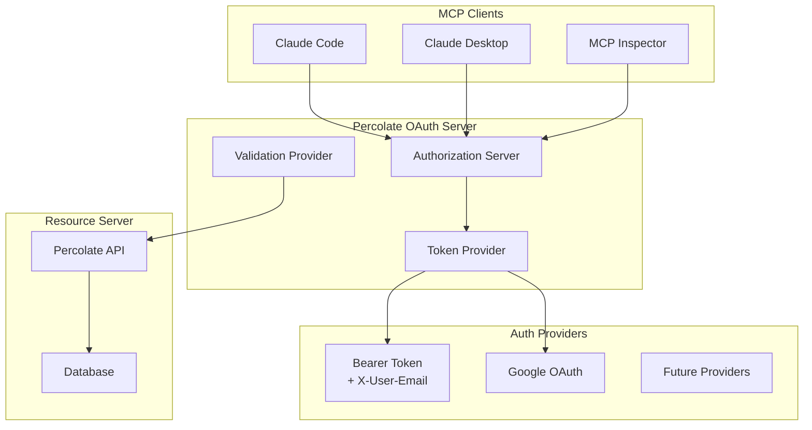
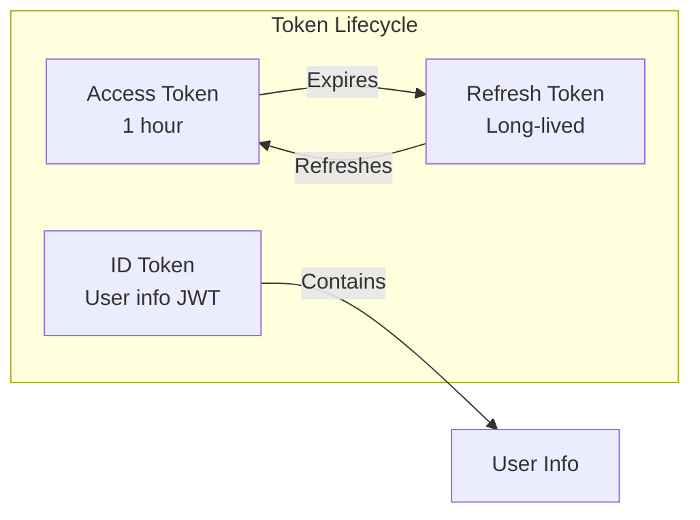
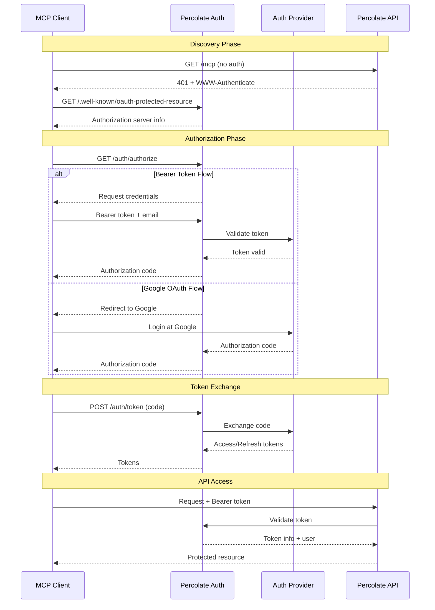

# Authentication Guide

## Table of Contents
1. [Overview](#overview)
2. [OAuth 2.1 Architecture](#oauth-21-architecture)
3. [Authentication Providers](#authentication-providers)
4. [Implementation Structure](#implementation-structure)
5. [Token Management](#token-management)
6. [API Endpoints](#api-endpoints)
7. [Security Considerations](#security-considerations)
8. [MCP Integration](#mcp-integration)
9. [Implementation Guide](#implementation-guide)
10. [Testing Authentication](#testing-authentication)

## Overview

Percolate implements OAuth 2.1 compliant authentication with support for multiple authentication providers. The system is designed to work seamlessly with MCP (Model Context Protocol) clients while maintaining security and flexibility.

### Key Features

- **OAuth 2.1 Compliant**: Standards-based authentication with OAuth 2.1 endpoints
- **Multiple Authentication Methods**: 
  - Bearer Token + Email header for API access
  - Google OAuth for user authentication
  - Session-based authentication for web applications
- **MCP Compatible**: Works with Claude Code, Claude Desktop, and other MCP clients
- **Token Management**: Secure token storage in database and sessions
- **Flexible Architecture**: Easy to add new authentication providers

## OAuth 2.1 Architecture



### OAuth 2.1 Roles

In our implementation:

- **Authorization Server**: Percolate OAuth server that handles authentication flows
- **Resource Server**: Percolate API endpoints protected by OAuth
- **Clients**: MCP clients (Claude Code, Claude Desktop, etc.)

## Authentication Providers

### 1. Bearer Token Provider

For API keys and service accounts. Requires both:
- `Authorization: Bearer <token>` header
- `X-User-Email: user@example.com` header

```python
# Example usage
headers = {
    "Authorization": "Bearer sk-1234567890abcdef",
    "X-User-Email": "user@example.com"
}
```

### 2. Google OAuth Provider

For user authentication via Google accounts:
- Uses OAuth 2.1 authorization code flow
- Supports PKCE for enhanced security
- Automatic token refresh

### Authentication Flow Comparison

| Provider | Use Case | Token Type | Refresh | User Interaction |
|----------|----------|------------|---------|------------------|
| Bearer Token | API/Service | Long-lived | Manual | None |
| Google OAuth | User Apps | Short-lived | Automatic | Initial login |

## Implementation Structure

### Directory Organization

```
clients/python/percolate/percolate/
├── auth/                           # Core authentication package
│   ├── __init__.py                # Package exports
│   ├── models.py                  # OAuth data models
│   ├── providers.py               # Authentication providers (Bearer, Google)
│   ├── server.py                  # OAuth server implementation
│   └── middleware.py              # Authentication middleware
│
└── api/
    ├── main.py                    # App initialization & OAuth setup
    │
    ├── controllers/
    │   └── oauth.py               # OAuth business logic controller
    │
    ├── routes/
    │   └── auth/
    │       ├── __init__.py        # Auth module initialization
    │       ├── router.py          # Session auth routes (Google login, connect)
    │       ├── oauth.py           # OAuth 2.1 standard endpoints
    │       ├── google_oauth.py    # Google OAuth client implementation
    │       └── utils.py           # Auth utility functions
    │
    └── utils/
        └── oauth.py               # OAuth well-known endpoint utilities
```

### Component Responsibilities

#### Core Authentication (`/auth/`)

- **models.py**: OAuth 2.1 data models (AuthRequest, TokenResponse, etc.), authentication errors, grant types
- **providers.py**: Base `AuthProvider` interface and implementations (Bearer, Google)
- **server.py**: Main OAuth 2.1 server coordinating providers
- **middleware.py**: Request authentication middleware and FastAPI dependencies

#### API Layer (`/api/`)

- **controllers/oauth.py**: Business logic for OAuth operations
- **routes/auth/oauth.py**: HTTP endpoint handlers for OAuth flows
- **utils/oauth.py**: Well-known endpoint implementations

## Token Management

### Token Types



### Token Storage

Tokens are stored in multiple locations:
- **Database**: User table stores tokens with session mapping
- **Session**: Server-side session storage for active sessions
- **File System**: Optional token persistence at `~/.percolate/auth/google/token`
- **Never stored**: In logs, URLs, or non-secure locations

## API Endpoints

### OAuth 2.1 Endpoints

| Endpoint | Purpose | Method |
|----------|---------|--------|
| `/.well-known/oauth-authorization-server` | OAuth metadata | GET |
| `/.well-known/oauth-protected-resource` | MCP discovery | GET |
| `/auth/authorize` | Start authorization flow | GET |
| `/auth/token` | Exchange code for tokens | POST |
| `/auth/revoke` | Revoke tokens | POST |
| `/auth/introspect` | Validate tokens | POST |
| `/auth/session/info` | Get session and user information | GET |
| `/auth/google/login` | Initiate Google OAuth flow | GET |
| `/auth/google/callback` | Handle Google OAuth callback | GET |
| `/auth/connect` | Get project settings with API key | GET |
| `/auth/register` | Dynamic client registration | POST |

### Authentication Flow



## Security Considerations

### Security Best Practices

1. **PKCE Support**: OAuth flows support PKCE for enhanced security
2. **HTTPS Recommended**: Use HTTPS in production environments
3. **Session Security**: Server-side sessions with secure cookies
4. **Token Validation**: All tokens are validated before use
5. **Audit Logging**: Authentication events are logged

### Token Security

#### Token Validation Requirements

**Bearer Tokens:**
- Must be provided in `Authorization: Bearer <token>` header
- Must include `X-User-Email` header
- Validated against database records

**OAuth Tokens:**
- ID tokens are JWT format
- Access tokens from Google OAuth
- Stored in user session and database
- Expiration tracked for refresh

## MCP Integration

### Client Configuration

#### Claude Code
```json
{
  "percolate": {
    "transport": "http",
    "url": "https://api.percolate.ai/mcp/",
    "auth": {
      "type": "oauth",
      "authorization_url": "https://api.percolate.ai/auth/authorize",
      "token_url": "https://api.percolate.ai/auth/token",
      "pkce": true
    }
  }
}
```

#### Claude Desktop
```json
{
  "mcpServers": {
    "percolate": {
      "transport": "http",
      "url": "https://api.percolate.ai/mcp/",
      "env": {
        "PERCOLATE_API_KEY": "sk-...",
        "PERCOLATE_USER_EMAIL": "user@example.com"
      }
    }
  }
}
```

### Authentication Context

The authentication system provides context through different mechanisms:

1. **OAuth/Bearer Token**: Available via `request.state.auth`
2. **Session Authentication**: Available via `request.session`
3. **Hybrid Authentication**: The `hybrid_auth` dependency checks both

```python
# Using hybrid authentication in endpoints
from percolate.api.routes.auth import hybrid_auth
from fastapi import Depends

@app.get("/api/endpoint")
async def my_endpoint(user_id: Optional[str] = Depends(hybrid_auth)):
    if user_id:
        # User is authenticated
        return {"user_id": user_id}
    else:
        # Anonymous request
        return {"message": "Not authenticated"}
```

## Implementation Guide

### Configuration

Set environment variables:

```bash
# Base URL
PERCOLATE_BASE_URL=https://api.percolate.ai

# Google OAuth (optional)
GOOGLE_OAUTH_CLIENT_ID=your-client-id
GOOGLE_OAUTH_CLIENT_SECRET=your-client-secret
GOOGLE_OAUTH_REDIRECT_URI=https://api.percolate.ai/auth/google/callback

# Automated authentication (optional)
OAUTH_USERNAME=user@example.com
OAUTH_PASSWORD=password
```

### Adding a New Provider

1. **Create provider class in `auth/providers.py`:**
```python
from percolate.auth.providers import AuthProvider
from percolate.auth.models import AuthRequest, AuthResponse, TokenRequest, TokenResponse, TokenInfo, AuthError
import time

class GitHubOAuthProvider(AuthProvider):
    def __init__(self, client_id: str, client_secret: str, redirect_uri: str):
        self.client_id = client_id
        self.client_secret = client_secret
        self.redirect_uri = redirect_uri
        
    async def authorize(self, request: AuthRequest) -> AuthResponse:
        """Handle authorization request"""
        # Validate the request
        if not request.client_id:
            raise AuthError("invalid_request", "Client ID required")
        
        # In real implementation, redirect to GitHub OAuth
        # This is a simplified example
        return AuthResponse(
            code="github-auth-code",
            state=request.state
        )
        
    async def token(self, request: TokenRequest) -> TokenResponse:
        """Exchange code for tokens"""
        # In real implementation, exchange with GitHub API
        return TokenResponse(
            access_token="github-access-token",
            token_type="Bearer",
            expires_in=3600,
            refresh_token="github-refresh-token"
        )
        
    async def validate(self, token: str) -> TokenInfo:
        """Validate access token"""
        # In real implementation, validate with GitHub API
        return TokenInfo(
            active=True,
            sub="github-user-id",
            email="user@example.com",
            exp=int(time.time()) + 3600
        )
        
    async def refresh(self, refresh_token: str) -> TokenResponse:
        """Refresh access token"""
        # In real implementation, refresh with GitHub API
        return TokenResponse(
            access_token="new-github-access-token",
            token_type="Bearer",
            expires_in=3600,
            refresh_token="new-github-refresh-token"
        )
```

2. **Register in `auth/server.py`:**
```python
# In OAuthServer.__init__
if os.getenv("GITHUB_CLIENT_ID"):
    self.providers["github"] = GitHubOAuthProvider(
        client_id=os.getenv("GITHUB_CLIENT_ID"),
        client_secret=os.getenv("GITHUB_CLIENT_SECRET"),
        redirect_uri=os.getenv("GITHUB_REDIRECT_URI")
    )
```

3. **Add provider-specific routes if needed in `api/routes/auth/`**

### Protecting Endpoints

```python
from percolate.auth.middleware import require_auth, get_auth
from percolate.auth.models import AuthContext
from fastapi import Depends

@app.get("/api/protected")
@require_auth(scopes=["read:data"])
async def protected_endpoint(auth: AuthContext = Depends(get_auth)):
    return {"user": auth.email, "data": "sensitive"}
```

### Client Implementation

```python
# Bearer token authentication with httpx
import httpx
import os

# Get credentials from environment
api_key = os.getenv("PERCOLATE_API_KEY")
user_email = os.getenv("PERCOLATE_USER_EMAIL")
base_url = os.getenv("PERCOLATE_BASE_URL", "http://localhost:5008")

# Create headers with both required values
headers = {
    "Authorization": f"Bearer {api_key}",
    "X-User-Email": user_email
}

# Make authenticated request
async with httpx.AsyncClient() as client:
    response = await client.get(
        f"{base_url}/api/chat",
        headers=headers
    )
    print(response.json())

# For OAuth flow, use the authorization endpoint
auth_url = f"{base_url}/auth/authorize?" + \
    "response_type=code&" + \
    "client_id=percolate-client&" + \
    "redirect_uri=http://localhost:8080/callback&" + \
    "code_challenge=your-pkce-challenge&" + \
    "code_challenge_method=S256"
# Open auth_url in browser for user authentication
```

## Testing Authentication

### Test Scenarios

1. **Bearer Token Auth**
```bash
# Valid authentication
curl -H "Authorization: Bearer sk-test" \
     -H "X-User-Email: test@example.com" \
     http://localhost:5008/api/chat

# Missing email header (should fail)
curl -H "Authorization: Bearer sk-test" \
     http://localhost:5008/api/chat

# Test authentication ping
curl -H "Authorization: Bearer sk-test" \
     -H "X-User-Email: test@example.com" \
     http://localhost:5008/auth/ping
```

2. **OAuth Flow**
```bash
# Start OAuth flow in browser
curl "http://localhost:5008/auth/google/login?redirect_uri=myapp://callback"

# This will redirect to Google, then back to:
# http://localhost:5008/auth/google/callback?code=...&state=...

# The callback will then redirect to:
# myapp://callback?token=<id_token>
```

3. **Session Information**
```bash
# Get current session info (requires session cookie)
curl -b cookies.txt "http://localhost:5008/auth/session/info"

# Get project connection info with API key
curl -H "Authorization: Bearer sk-test" \
     "http://localhost:5008/auth/connect"
```

### Example Usage

See complete examples in:
- `/examples/oauth_client.py` - OAuth client implementation
- `/examples/mcp_oauth_example.py` - MCP integration examples
- `/tests/test_oauth.py` - Unit tests

## Summary

Percolate's authentication system provides:

1. **Flexibility**: Multiple auth providers for different use cases
2. **Security**: OAuth 2.1 compliance with modern security practices
3. **Compatibility**: Works with all MCP clients
4. **Extensibility**: Easy to add new providers
5. **Developer Experience**: Simple to use, hard to misuse

The system ensures that whether you're using API keys for automation or Google OAuth for user applications, authentication is secure, seamless, and standards-compliant.