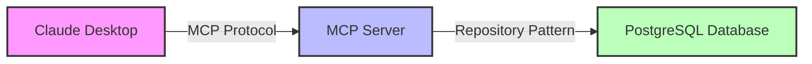
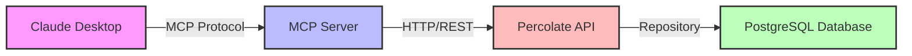

# Percolate MCP Server Documentation

## Table of Contents
1. [Overview](#overview)
2. [Architecture](#architecture)
3. [Authentication](#authentication)
4. [Available Tools](#available-tools)
5. [Deployment Options](#deployment-options)
6. [API Integration](#api-integration)
7. [Desktop Extension (DXT)](#desktop-extension-dxt)
8. [Configuration](#configuration)
9. [Development Guide](#development-guide)
10. [Security Considerations](#security-considerations)

## Overview

The Percolate MCP (Model Context Protocol) Server provides a standardized interface for AI assistants to interact with Percolate's knowledge base, entities, functions, and resources. Built on [FastMCP](https://gofastmcp.com/llms-full.txt), it supports both stdio mode (for desktop applications) and HTTP streaming mode (for server deployments).

### Key Features
- **Direct SDK Integration**: Uses Percolate's Python client directly, not HTTP API calls
- **Flexible Authentication**: Supports both API key + email and OAuth token authentication
- **Row-Level Security**: All operations respect Percolate's security model
- **Multiple Deployment Modes**: Desktop extension (DXT) or server-mounted HTTP endpoint
- **Comprehensive Tools**: Entity management, function discovery/execution, file uploads, and AI-powered help

## Architecture

The MCP server supports two deployment architectures:

### 1. Direct Database Mode
In this mode, the MCP server connects directly to the PostgreSQL database using the repository pattern. This provides:
- Low latency operations
- Full access to database features
- Row-level security (RLS) enforcement
- Suitable for self-hosted deployments



### 2. API Proxy Mode (Default)
In this mode, the MCP server acts as a wrapper around the Percolate API. This provides:
- Cloud deployment compatibility
- API authentication and authorization
- Rate limiting and monitoring
- Suitable for SaaS deployments



### Directory Structure
```
percolate/api/mcp_server/
├── __init__.py              # Package initialization and exports
├── server.py                # FastMCP server creation and configuration
├── app.py                   # FastAPI app for standalone HTTP mode
├── config.py                # Configuration management using pydantic
├── auth.py                  # Authentication provider implementation
├── base_repository.py       # Abstract base class for repository pattern
├── database_repository.py   # Direct database implementation
├── api_repository.py        # API proxy implementation
├── repository_factory.py    # Factory for creating repository instances
├── integration.py           # API mounting helper functions
├── tools/                   # MCP tool implementations
│   ├── __init__.py
│   ├── entity_tools.py      # Entity CRUD operations
│   ├── function_tools.py    # Function search and evaluation
│   ├── help_tools.py        # AI-powered help using PercolateAgent
│   └── file_tools.py        # File upload and resource search
├── tests/                   # Test suite
│   ├── test_integration.py  # Real backend integration tests
│   └── ...                  # Unit tests for each component
└── scripts/
    └── dxt/                 # Desktop extension build scripts
        ├── manifest.json    # DXT configuration
        └── build_dxt.sh     # Build script
```

### Core Components

#### 1. **Repository Pattern** (base_repository.py, database_repository.py, api_repository.py)
The repository pattern provides a clean abstraction for all data operations with two implementations:

**BaseMCPRepository** - Abstract interface defining all operations
**DatabaseRepository** - Direct PostgreSQL access:
- Manages user context (ID, email, groups, role level)
- Handles entity CRUD operations via Percolate models
- Manages function discovery and execution
- Coordinates file uploads to S3
- Uses PercolateAgent for help queries

**APIProxyRepository** - HTTP/REST proxy:
- Translates repository calls to API endpoints
- Handles authentication headers
- Maps responses to expected formats
- Provides compatibility with cloud deployments

**repository_factory.py** - Automatic mode selection based on configuration

#### 2. **Authentication** (auth.py)
The `PercolateAuthProvider` supports multiple authentication methods:
- **API Key + Email**: Bearer token with required X-User-Email header
- **OAuth Token**: Self-contained token with embedded user context
- **Desktop Mode**: Local validation against configured credentials
- **Server Mode**: Validates against Percolate API's `/auth/me` endpoint

#### 3. **Configuration** (config.py)
Uses Pydantic settings with environment variable support:
- Integrates with Percolate's existing `from_env_or_project()` pattern
- Supports `.env` files and environment variables
- Provides sensible defaults (e.g., api.percolationlabs.ai)
- Desktop extension mode detection via `P8_MCP_DESKTOP_EXT`

## Authentication

### API Key Authentication
Requires both an API key and user email for proper context:

```bash
# Environment variables
export P8_API_KEY="your-api-key"
export P8_USER_EMAIL="user@example.com"
```

HTTP Request:
```http
Authorization: Bearer your-api-key
X-User-Email: user@example.com
```

### OAuth Token Authentication
Uses tokens from Percolate's OAuth flow:

```bash
# Environment variable
export P8_OAUTH_TOKEN="your-oauth-token"
```

HTTP Request:
```http
Authorization: Bearer your-oauth-token
```

### Authentication Flow
1. Client sends credentials (token + optional email)
2. Desktop mode: Validates against local configuration
3. Server mode: Validates against Percolate API
4. Success: Returns user context (ID, groups, role level)
5. Context propagated to all repository operations

## Available Tools

### 1. Entity Management

#### `get_entity`
Retrieves a specific entity by ID from the knowledge base.

**Parameters:**
- `entity_id` (string, required): Unique identifier of the entity
- `entity_type` (string, optional): Entity type for faster lookup

**Returns:** Raw entity data as dictionary

**Example:**
```json
{
  "entity_id": "550e8400-e29b-41d4-a716-446655440000",
  "entity_type": "Model"
}
```

#### `entity_search`
Searches for entities using Percolate's search capabilities.

**Parameters:**
- `query` (string, required): Search query
- `filters` (object, optional): Filter criteria
- `limit` (integer, default: 10): Maximum results (1-100)

**Returns:** List of matching entities

**Example:**
```json
{
  "query": "machine learning models",
  "filters": {"type": "Model", "tags": ["production"]},
  "limit": 20
}
```

### 2. Function Discovery and Execution

#### `function_search`
Searches for available functions/tools in Percolate.

**Parameters:**
- `query` (string, required): Search query
- `limit` (integer, default: 10): Maximum results

**Returns:** List of function definitions from the Function model

**Example:**
```json
{
  "query": "data processing",
  "limit": 5
}
```

#### `function_eval`
Executes a specific function by name.

**Parameters:**
- `function_name` (string, required): Exact function name
- `args` (object, required): Function arguments as JSON

**Returns:** Function execution result

**Example:**
```json
{
  "function_name": "calculate_metrics",
  "args": {
    "dataset_id": "dataset-123",
    "metrics": ["accuracy", "precision"]
  }
}
```

### 3. File and Resource Management

#### `file_upload`
Uploads a file to Percolate for ingestion and embedding.

**Parameters:**
- `file_path` (string, required): Local file path
- `description` (string, optional): File description
- `tags` (array, optional): Tags to associate

**Returns:** Upload status and resource ID

**Process:**
1. Validates file existence
2. Uploads to S3 storage
3. Triggers background ingestion
4. Creates chunked resources with embeddings

**Example:**
```json
{
  "file_path": "/path/to/document.pdf",
  "description": "Q4 2024 Financial Report",
  "tags": ["finance", "quarterly", "2024"]
}
```

#### `resource_search`
Searches for resources using the Resource model.

**Parameters:**
- `query` (string, required): Search query
- `resource_type` (string, optional): Type filter
- `limit` (integer, default: 10): Maximum results

**Returns:** List of matching resources

**Example:**
```json
{
  "query": "financial reports",
  "resource_type": "document",
  "limit": 15
}
```

### 4. AI-Powered Help

#### `help`
Uses PercolateAgent to search the knowledge base and provide contextual assistance.

**Parameters:**
- `query` (string, required): Help query
- `context` (string, optional): Additional context
- `max_depth` (integer, default: 3): Agent recursion depth (1-10)

**Returns:** AI-generated response string

**Example:**
```json
{
  "query": "How do I create a new ML pipeline?",
  "context": "I'm using scikit-learn and need to process CSV data",
  "max_depth": 5
}
```

## Deployment Options

### 1. Integrated with Percolate API

The MCP server is automatically mounted when running the main Percolate API:

```python
# In percolate/api/main.py
from .mcp_server import mount_mcp_server
mount_mcp_server(app, path="/mcp")
```

**Access:**
- Base URL: `http://localhost:8080/mcp`
- Health check: `http://localhost:8080/mcp/health`
- MCP protocol: `http://localhost:8080/mcp/` (FastMCP handles routing)

### 2. Standalone HTTP Server

Run MCP server independently:

```bash
# Using the app module
python -m percolate.api.mcp_server.app

# Or with uvicorn
uvicorn percolate.api.mcp_server.app:app --port 8001
```

### 3. Desktop Extension (Stdio Mode)

For desktop MCP clients:

```bash
python -m percolate.api.mcp_server
```

This runs in stdio mode, communicating via stdin/stdout with the desktop client.

## API Integration

### Mounting Process

The MCP server integrates with FastAPI using shared lifespan management:

```python
# integration.py
def mount_mcp_server(app: FastAPI, path: str = "/mcp"):
    settings = get_mcp_settings()
    
    # Only mount if configured
    if not settings.api_key:
        logger.info("MCP server not mounted - no P8_API_KEY configured")
        return None
    
    # Create MCP server
    mcp = create_mcp_server()
    
    # Get HTTP app with path
    mcp_app = mcp.http_app(path=path)
    
    # Mount with shared lifespan
    app.mount(path, mcp_app)
```

### Request Flow
1. Request arrives at `/mcp/*`
2. FastAPI routes to mounted MCP app
3. MCP app handles authentication
4. Tools execute with user context
5. Results returned as JSON or streaming response

### Authentication Middleware
The MCP server respects the main API's authentication middleware:
- Excluded from general auth requirements
- Implements its own bearer token validation
- Integrates with Percolate's user context system

## Desktop Extension (DXT)

### Building the Extension

```bash
cd percolate/api/mcp_server/scripts/dxt
./build_dxt.sh
```

The build script:
1. Creates temporary build directory
2. Copies MCP server code
3. Installs dependencies to `lib/`
4. Packages with `npx @anthropic-ai/dxt pack`
5. Outputs `.dxt` file for installation

### DXT Manifest Configuration

```json
{
  "dxt_version": "0.1",
  "name": "percolate-mcp",
  "server": {
    "type": "python",
    "entry_point": "server/percolate/api/mcp_server/server.py",
    "mcp_config": {
      "command": "python",
      "args": ["-m", "percolate.api.mcp_server"],
      "env": {
        "PYTHONPATH": "${__dirname}/server:${__dirname}/server/lib",
        "P8_API_ENDPOINT": "${user_config.api_endpoint}",
        "P8_API_KEY": "${user_config.api_key}",
        "P8_OAUTH_TOKEN": "${user_config.oauth_token}",
        "P8_USER_EMAIL": "${user_config.user_email}",
        "P8_MCP_DESKTOP_EXT": "true"
      }
    }
  },
  "user_config": {
    "api_endpoint": {
      "type": "string",
      "title": "Percolate API Endpoint",
      "default": "https://api.percolationlabs.ai",
      "required": true
    },
    "api_key": {
      "type": "string",
      "title": "API Key (Bearer Token)",
      "secret": true
    },
    "oauth_token": {
      "type": "string", 
      "title": "OAuth Access Token",
      "secret": true
    },
    "user_email": {
      "type": "string",
      "title": "User Email",
      "format": "email"
    }
  }
}
```

### Installation Process
1. User installs `.dxt` file in their MCP client
2. Client prompts for configuration (API endpoint, auth)
3. Client spawns Python process with configured environment
4. MCP server runs in stdio mode
5. Communication via JSON-RPC over stdin/stdout

## Configuration

The MCP server defaults to API proxy mode. To use direct database mode, set P8_USE_API_MODE=false:

### API Proxy Mode (Default)
```bash
# API endpoint (defaults to https://api.percolationlabs.ai)
P8_API_ENDPOINT=http://localhost:5008  # For local development

# Authentication - uses fallback chain:
# 1. Bearer token from request headers
# 2. P8_API_KEY environment variable
# 3. P8_PG_PASSWORD environment variable
# 4. "postgres" for development

# User identification (matches HTTP header name)
X-User-Email=user@example.com
```

### Direct Database Mode (Special Case)
```bash
# Disable API mode
P8_USE_API_MODE=false

# Database connection
P8_PG_HOST=localhost
P8_PG_PORT=5432
P8_PG_DATABASE=app
P8_PG_USER=myuser
P8_PG_PASSWORD=mypassword

# User context for RLS
P8_USER_ID=system-user-id
X-User-Email=user@example.com
```

### Environment Variables

#### API Configuration
- `P8_API_ENDPOINT`: Percolate API URL (default: https://api.percolationlabs.ai)
- `P8_USE_API_MODE`: Use API proxy mode (default: true). Set to false for direct database access

#### Authentication
- `P8_API_KEY`: API key for bearer token auth
- `P8_OAUTH_TOKEN`: OAuth access token
- `X-User-Email`: User email (matches HTTP header name, required with API key)

#### Database Configuration
- `P8_PG_HOST`: PostgreSQL host
- `P8_PG_PORT`: PostgreSQL port (default: 5432)
- `P8_PG_DATABASE`: Database name
- `P8_PG_USER`: Database user
- `P8_PG_PASSWORD`: Database password

#### User Context
- `P8_USER_ID`: Override default user ID
- `P8_USER_GROUPS`: Comma-separated groups
- `P8_ROLE_LEVEL`: Role level (1=admin)

#### Server Settings
- `P8_DEFAULT_MODEL`: Default LLM (default: gpt-4o-mini)
- `P8_MCP_PORT`: HTTP server port (default: 8001)
- `P8_LOG_LEVEL`: Logging level (default: INFO)

### Configuration Loading
1. Environment variables (highest priority)
2. `.env` file in working directory
3. Percolate account settings (via `from_env_or_project`)
4. Default values

## Development Guide

### Adding New Tools

1. **Create Tool Module**
```python
# tools/my_tools.py
from pydantic import BaseModel, Field
from fastmcp import FastMCP
from ..repository import MCPRepository

class MyToolParams(BaseModel):
    param1: str = Field(..., description="Parameter description")

def create_my_tools(mcp: FastMCP, repository: MCPRepository):
    @mcp.tool(
        name="my_tool",
        description="Tool description",
        annotations={"tags": ["category"]}
    )
    async def my_tool(params: MyToolParams):
        return await repository.my_operation(params.param1)
```

2. **Add Repository Method**
```python
# repository.py
async def my_operation(self, param1: str):
    # Implementation
    pass
```

3. **Register in Server**
```python
# server.py
from .tools import create_my_tools
create_my_tools(mcp, repository)
```

### Testing

#### Unit Tests
```bash
pytest percolate/api/mcp_server/tests/ -k "not integration"
```

#### Integration Tests
```bash
export P8_API_KEY="your-key"
export P8_USER_EMAIL="your-email"
pytest percolate/api/mcp_server/tests/test_integration.py
```

### Debugging

#### Enable Debug Logging
```bash
export P8_LOG_LEVEL=DEBUG
```

#### Test Individual Tools
```python
# Interactive testing
from percolate.api.mcp_server.repository import MCPRepository
repo = MCPRepository(user_email="test@example.com")
result = await repo.search_entities("test query")
```

## Security Considerations

### Row-Level Security
- All operations use Percolate's RLS system
- User context propagated to every database query
- System user fallback with appropriate permissions

### Token Security
- API keys should never be committed to code
- Use environment variables or secure vaults
- OAuth tokens should be short-lived
- Desktop extensions store credentials securely

### API Validation
- Server mode validates tokens against Percolate API
- Desktop mode uses local validation with fallback
- Failed auth attempts are logged

### Input Validation
- All tool parameters use Pydantic models
- File paths validated before upload
- Query parameters sanitized
- Size limits enforced (e.g., 100 result maximum)

### Network Security
- HTTPS recommended for production
- X-User-Email header prevents token sharing
- API endpoint configuration prevents phishing
- Desktop extension runs locally (no network exposure)

## Troubleshooting

### Common Issues

1. **Authentication Failures**
   - Verify P8_API_KEY is set correctly
   - Ensure P8_USER_EMAIL is provided with API key
   - Check token hasn't expired (OAuth)
   - Verify API endpoint is accessible

2. **Tool Execution Errors**
   - Check user has appropriate permissions
   - Verify entity/resource exists
   - Check function parameters match schema
   - Review logs for detailed errors

3. **Desktop Extension Issues**
   - Ensure Python is in PATH
   - Verify all dependencies installed
   - Check manifest.json syntax
   - Review client logs for spawn errors

4. **Integration Problems**
   - Verify MCP server is mounted (`/mcp/health`)
   - Check for port conflicts
   - Ensure database is accessible
   - Verify S3 credentials for uploads

### Debug Commands

```bash
# Test authentication
curl -H "Authorization: Bearer $P8_API_KEY" \
     -H "X-User-Email: $P8_USER_EMAIL" \
     http://localhost:8080/mcp/health

# Test tool execution
curl -X POST http://localhost:8080/mcp/tools/entity_search \
     -H "Authorization: Bearer $P8_API_KEY" \
     -H "X-User-Email: $P8_USER_EMAIL" \
     -H "Content-Type: application/json" \
     -d '{"query": "test"}'
```

## Architecture Benefits

### Direct Database Mode
- **Performance**: Direct database queries are faster
- **Features**: Full access to PostgreSQL features
- **Security**: RLS provides fine-grained access control
- **Simplicity**: Fewer moving parts

### API Proxy Mode
- **Scalability**: API can handle rate limiting and caching
- **Flexibility**: Works with cloud deployments
- **Monitoring**: Centralized logging and metrics
- **Updates**: API can evolve independently

Choose the mode that best fits your deployment scenario and security requirements.

## Resources

- [FastMCP Documentation](https://gofastmcp.com/llms-full.txt)
- [Model Context Protocol Spec](https://modelcontextprotocol.io/)
- [Percolate Python SDK](../clients/python/README.md)
- [API Authentication Guide](./05-Authentication.md)