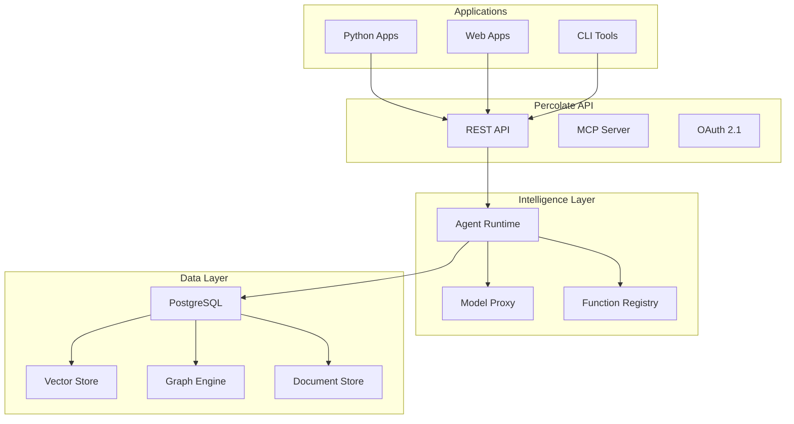

# Percolate Documentation

Welcome to the comprehensive documentation for Percolate - a revolutionary AI-powered database system that brings intelligence directly into your data layer.

## What is Percolate?

Percolate is a **relational-vector-graph database** designed specifically for building agentic AI systems. By extending PostgreSQL with AI capabilities, Percolate enables you to:

- 🤖 Run AI queries directly in SQL
- 🔍 Combine semantic search with traditional queries  
- 🌐 Build sophisticated agent systems with minimal code
- 📊 Store and query relational, vector, graph, and document data in one place
- 🔒 Leverage enterprise-grade security with row-level access control
- ⚡ Stream real-time AI responses to your applications

## Quick Start

```bash
# Install Percolate
pip install percolate-db

# Run your first AI query
p8 ask "What insights can you find in my data?"
```

## Documentation Index

### 📚 Core Documentation

1. **[Architecture Guide](./01-architecture.md)**
   - System design and philosophy
   - Component overview
   - Data flow and security architecture
   - Scalability patterns

2. **[API Reference](./02-api-reference.md)**
   - Complete REST API documentation
   - Authentication methods
   - Endpoint specifications
   - WebSocket and streaming support

3. **[Database Usage](./03-database-usage.md)**
   - SQL vs Python approaches
   - Core SQL functions
   - Vector search and graph queries
   - Performance optimization

4. **[Deployment Guide](./04-deployment.md)**
   - Docker and Docker Compose setup
   - Kubernetes deployment
   - Production configuration
   - Monitoring and backup strategies

5. **[Building Agents](./05-building-agents.md)**
   - Creating agents from scratch
   - Function integration
   - Multi-agent systems
   - Testing and debugging agents

6. **[Data Models](./06-data-models.md)**
   - Core type system
   - Model definitions
   - Schema evolution
   - Best practices

7. **[Model Runners & Proxy](./07-model-runners-proxy.md)**
   - LLM proxy architecture
   - Streaming implementation
   - Function calling
   - Error handling and retries

## Key Features

### 🧠 AI-Native Database

```sql
-- Run AI queries directly in SQL
SELECT * FROM percolate('Analyze customer sentiment from recent reviews');

-- Note: The percolate function returns (message_response, tool_calls, tool_call_result, session_id_out, status)
-- It uses the default p8.PercolateAgent internally
```

### 🤖 Declarative Agents

```python
import percolate as p8
from percolate.models import AbstractModel

class CustomerServiceAgent(AbstractModel):
    """I help customers with their inquiries and issues."""
    
    @classmethod
    def get_model_functions(cls):
        return {
            'search_knowledge': "Search help documentation",
            'check_order': "Look up order status",
            'create_ticket': "Create support ticket"
        }

# Create a model runner
agent = p8.Agent(CustomerServiceAgent)
# Use the agent
response = agent.run("My order hasn't arrived yet")
```

### 🔍 Unified Data Platform

```python
# Repository pattern for data access
import percolate as p8
from percolate.models import Resources

# Search resources
repo = p8.repository(Resources)
results = repo.select(name__ilike="%machine learning%")

# Execute SQL queries
results = p8.query("""
    SELECT customer_id, 
           percolate('Summarize behavior: ' || activity_log) as summary
    FROM customer_activity
    WHERE date > CURRENT_DATE - INTERVAL '7 days'
""")
```

## Use Cases

### 🏢 Enterprise Applications

- **Customer Service**: AI-powered support agents with access to your knowledge base
- **Business Intelligence**: Natural language queries over complex datasets
- **Content Management**: Semantic search and automatic categorization
- **Compliance**: Automated document analysis and reporting

### 🚀 Developer Tools

- **Code Analysis**: AI-powered code review and documentation
- **DevOps**: Intelligent monitoring and incident response
- **API Integration**: Unified interface for multiple services
- **Testing**: Automated test generation and validation

### 🔬 Research & Analytics

- **Data Science**: Combined SQL and AI analysis workflows
- **Knowledge Graphs**: Entity extraction and relationship mapping
- **Document Processing**: Automatic summarization and insights
- **Real-time Analytics**: Streaming AI analysis of events

## Getting Started

### Prerequisites

- PostgreSQL 16+ or Docker
- Python 3.8+
- 8GB RAM minimum (16GB+ recommended for production)

### Installation Options

#### Option 1: Docker (Recommended)

```bash
# Clone the repository
git clone https://github.com/percolate-ai/percolate
cd percolate

# Start with Docker Compose
docker-compose up -d

# Initialize the database
docker-compose exec postgres psql -U postgres -d percolate -f /init.sql
```

#### Option 2: Python Package

```bash
# Install package
pip install percolate-db

# Set up database connection
export P8_PG_HOST="localhost"
export P8_PG_PORT="5432"
export P8_PG_DB="percolate"
export P8_PG_USER="postgres"
export P8_PG_PASSWORD="your-password"

# Apply database schema
p8 init
```

### Your First Agent

```python
import percolate as p8
from percolate.models import AbstractModel

# Define an agent model
class DataAnalyst(AbstractModel):
    """I analyze data and provide insights."""
    
    name: str = "data-analyst"

# Create a model runner
agent = p8.Agent(DataAnalyst)
# Run the agent
result = agent.run("What are the top trends in our sales data?")
print(result)
```

## Architecture Overview



## Community & Support

### 🌟 Get Involved

- **GitHub**: [github.com/percolate-ai/percolate](https://github.com/percolate-ai/percolate)
- **Discord**: [Join our community](https://discord.gg/percolate)
- **Twitter**: [@percolate_ai](https://twitter.com/percolate_ai)

### 📖 Resources

- **Blog**: [blog.percolate.ai](https://blog.percolate.ai)
- **Examples**: [github.com/percolate-ai/examples](https://github.com/percolate-ai/examples)
- **Video Tutorials**: [YouTube Channel](https://youtube.com/@percolate-ai)

### 🤝 Contributing

We welcome contributions! Please see our [Contributing Guide](../CONTRIBUTING.md) for details.

### 📄 License

Percolate is licensed under the [Apache License 2.0](../LICENSE).

## Next Steps

1. **[Follow the Quickstart](./01-architecture.md#quick-start)** - Get up and running in minutes
2. **[Build Your First Agent](./05-building-agents.md#your-first-agent)** - Create an AI agent
3. **[Explore the API](./02-api-reference.md)** - Integrate with your applications
4. **[Deploy to Production](./04-deployment.md)** - Scale your deployment

---

<p align="center">
  <strong>Percolate - Where Data Meets Intelligence</strong><br>
  Built with ❤️ by the Percolate Team
</p>